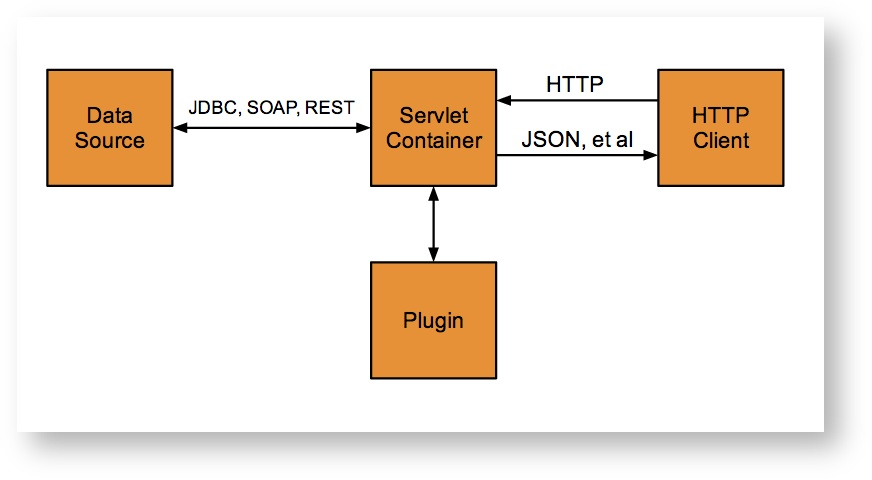
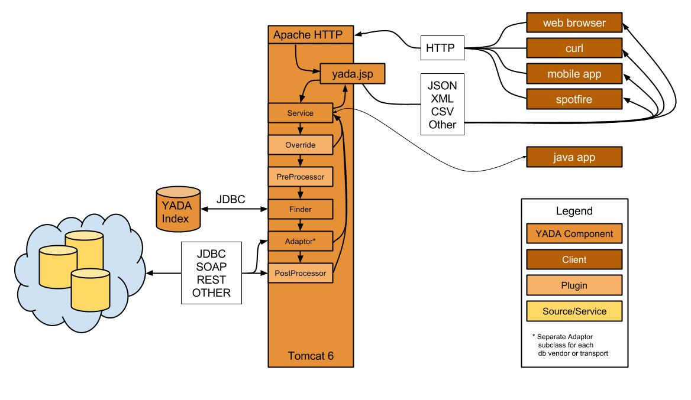
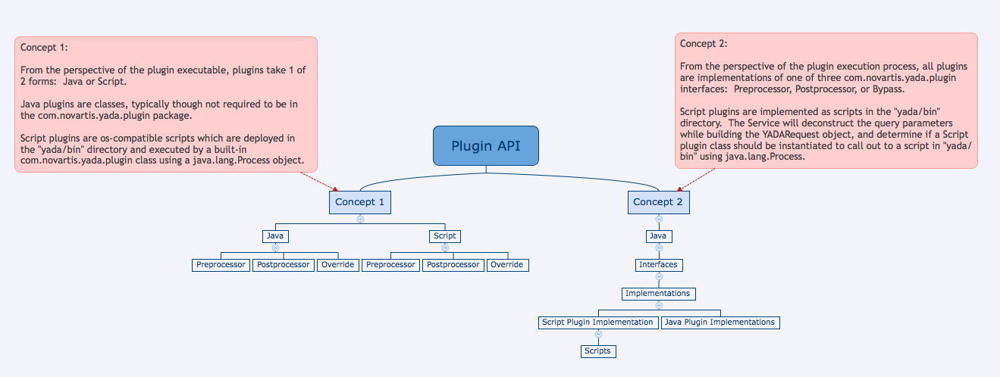

Skip to the [Quickstart/Deployment Guide]

# Why YADA? 

    

  

**YADA** is like a [_Universal Remote Control_](https://en.wikipedia.org/wiki/Universal_remote) for data.

For example, what if you could access 

* *any* data set
* at *any* data source
* in *any* format
* from *any* environment
* using *just* a URL
* with just *one-time* configuration?

You can with **YADA**.

Or, what if you could get data

* from *multiple* sources
* in *different* formats,
* *merging* the results
* into a *single* set
* *on-the-fly*
* with *uniform* column names
* using *just one* URL?

You can with **YADA**.

# What is YADA?

**YADA** exists to simplify data access and eliminate work.

**YADA** is a lightweight framework for data retrieval, searching, storage, and manipulation.

**YADA** is an instant web service for your data.

**YADA** is a tool to enable efficient development of interfaces and data-processing pipelines.

**YADA** is as an implementation of [Thin Server Architecture].  

**YADA** is anti-middleware.

**YADA** is an acronym for "Yet Another Data Abstraction."

**YADA** is an open source software framework distributed by [Novartis Institutes for BioMedical Research](http://opensource.nibr.com) under the [Apache 2.0 license](http://www.apache.org/licenses/LICENSE-2.0.html).

Its [raisons d'être] are to enable efficient, non-redundent development of data-dependent applications and utilities, data source querying, data analysis, processing pipelines, extract, transform, and load (ETL) processes, etc.  **YADA** does all this while preserving total decoupling between data access and other aspects of application architecture such as user interface.

# Still like "Huh?"
**YADA** is a software framework, which means it is a collection of software tools forming a basic structure underlying a system, for developers and data analysts to use to create new tools and solutions in a new way.

The novelty and utility of YADA lies in its centralization of management of data source access configuration. It simplifies these aspects of software development by eliminating many steps, thereby enabling rapid development, standardization of access methods, and the code in which these methods are implemented. Further it strongly encourages reuse of existing configurations (once configured.) 

As a result of these configuration facilities, YADA enables the aggregation or integration of data from multiple data sources using a standard method, agnostic with regard to any vendor or technology-specific details of disparate data source implementations. 

For example, the conventional method to access, or furthermore, combine data from say, an Oracle® database, and a web service, is to write code which connects to each database or service independently using different methods and libraries, write code to execute embedded queries independently, also using different methods and libraries, and write code to parse and aggregate the separately acquired data sets.  Then the data is typically fed to an analysis tool.

With YADA, the data source connections and application-specific queries are stored securely and centrally, the queries are executed using identical methods (despite the different sources,) and the data can be integrated or aggregated on-the-fly.  

For software developers and data analysts alike, these features offer potentially tremendous time savings, faster time-to-delivery, and a larger percentage of time focused not on the tedium of configuration, but on the specific context of a software solution or data analysis.

# What's in this document?

This document contains an overview of the framework and features. Check out the [Quickstart/Deployment Guide] for details on getting started.

## Table of Contents

1. [Other Documentation]
2. [Getting into the YADA Mindset]
3. [Features]
4. [Architecture]
4. [History]
5. [YADA Apps and Uses]
6. [Data Sources]
7. [Plugins]
4. [Installation] \(links directly to the [Quickstart/Deployment Guide])
5. [License]
5. [Known Issues]

# Other Documentation
## Getting Started
* [Quickstart/Deployment Guide]

## Advanced Documentation
* [YADA Admin Guide]
* [User Guide]
* [Plugin Use and Development Guide]
* [Testing Notes]

## Specifications
* [Javadoc]
* [YADA Parameter Specification]
* [JSONParams Specification]
* [Harmonizer Guide and Specification]
* [Java® Visual Reference]
* [Filters Specification]
* [Mail Specification]

# Getting into the YADA Mindset

YADA exists to simplify data access and eliminate work.

YADA may be exactly what you've been looking for, or it may be a solution to a problem you didn't know you had. YADA is the perfect tool for many use-cases. Here are a few examples. Suppose you are a

## Scientist or Data Analyst...

The new numbers are in from the lab, or from last night's feed, and uploaded to your database or data warehouse.  You want to create a new visualization in your favorite statistical analysis package, but you're not sure how to connect to the database.  Your data gal helped you set it up in Python once, but since then, you just run the script to get the data.  Now you need it in a different environment.

If your data gal had set up a **YADA** query for your datasource, you could simply run the query in your web browser to download the data, or use any module that will retrieve data from a url. You can reuse the _very same query_ that was already configured for your other tasks.

## Datasource Owner/Curator...

Your constituents want their data, and they call you. Everyone wants basically the same set of columns but with a different "WHERE" clause, i.e., they each want a different subset of rows. Some can handle connection strings, but most can't.

So you configure your datasource in the **YADA** server, store a query, and send the same url to every one, explaining to them where to plug in the values in the query parameter string so they get only the data they want. They might see some columns they don't want but they can easily ignore them. If someone complains, heck, you just store another similar query with a different name, and voilà.

## Software User Interface Developer...

You hate middleware. Every time you want to extend the data model, you have to change your Resource layer, your DAO layer, your DAOImpls, your DTOs, your Model classes, your UI code, etc. You might have to touch 20 files to add one field.

Not so with **YADA**. 

With **YADA**, you change your stored query, and you change the code that executes the stored query, whether it's a javascript-based ajax call, or a perl LWP request, or a curl call from a shell script. As long as your client speaks HTTP, **YADA** will deliver your data.

## Software Middleware Developer...

Even you, middleware guy, can benefit from **YADA**. 

Maybe you have to provide a RESTful interface to an existing application, and need to deliver in such a short window, or have only a handful of users, so a fully-specified REST service is not practical. Maybe you need to access an existing REST interface and can't use your own proxy script; or, you have to grant access to a unix filesystem without mapping it in Apache or changing privileges. Perhaps the business wants to integrate some existing perl-based pipeline processes into a user interface or your Javascript UI team is already using **YADA**, and needs a Java® plugin to post-process data it's retrieving from a third party. 

# Features

* Data vendor- and technology-agnostic
* Accesses any JDBC, SOAP, or REST, and some Filesystem datasources 
* Delivers data as JSON (default), XML, or CSV, TSV, Pipe, or custom-delimited, natively, and in any other format via custom Response and Converter classes, or Plugins
* Executes multiple queries in a single HTTP request
* On-the-fly inner and outer joins across disparate data sources
* Ad hoc Harmonization (i.e., single http request to multiple data sources with harmonized results)
* Utilizes JDBC transactions (e.g., multiple inserts in a single HTTP request, with a single commit/rollback)
* Commits a single query or an entire request
* Processes file uploads
* Compatible with any client that speaks HTTP (e.g., web browser, python, curl, javascript, spotfire, curl, web service, mobile app, etc)
* Flexible Java® and Script plugin API to preprocess request parameters, post-process results, or override normal processing altogether
* EhCache query-index caching
* Security (via Cookie forwarding and/or Default Plugins)
* Support for Oracle®, MySQL®, Vertica®, PostgreSQL®, SQLite®
* Tomcat 7 and JDK 1.7-compatible (YADA 6)
* _Coming Soon_: ElasticSearch® support
* _Coming Soon_: ElasticSearch®-based result and aggregate-result caching
* _Coming Soon_: Spark-based result post-processor
* _Coming Soon_: Dynamic memory management and caching to facilitate large-scale request queuing and high volume result transformation in high frequency environments
* _Coming Later_: SQL DDL
* _Coming Later_: Dynamic datasource configuration
* _Coming Later_: MongoDB® and other NoSQL support
* _Coming Later_: SQL Server® support
* _Coming Later_: Node.js® port (maybe?)
* _Coming Later_: Standalone java application

# Architecture

A quick overview of the architecture
## Generic
About as basic as it can be...

## Specific
...and a little bit more specific:
> Note the image indicates Tomcat 6. It should be Tomcat **7**

# History

YADA grew organically from a reverse-engineering effort. 

Over the course of a few years, a scientist had developed an array of Perl CGI applications with thousands of lines of embedded SQL and Javascript. 

Then he abruptly left the company. 

He was not a trained, nor experienced software developer, he made little use of third party libraries, and violated a lot of conventions. 

To gain an understanding of his code in order to maintain, extend, or replace it, SQL queries were extracted from the code, stored in a database, and given unique names.  

A "finder" function was written in Perl to retrieve the SQL by name.  

This "finder" was extended to support the passing of parameters.  

Soon thereafter, this perl utility was ported to Java®. The burgeoning framework was extended further to support multiple data types, INSERT, UPDATE, and DELETE statements in addition to SELECT statements, JDBC transactions, SOAP queries, plugins, I/O, and so on.

# YADA "Apps" and uses

Most YADA "Apps" are [single-page Javascript applications](http://en.wikipedia.org/wiki/Single-page_application) running in web browsers. YADA is also heavily utilized by data analysts and bioinformaticians who need parameterized, delimited data subsets imported into their analysis tools such as R and Spotfire, or to be used by Perl or Python-based data processing pipelines. 

# Data Sources

YADA ships with scripts for using, as the YADA Index:

* MySQL®
* PostgreSQL® 
* SQLite®
* Oracle®

Soon the index will be stored in ElasticSearch®, but ultimately, it is vendor-agnostic. Other supported data sources currently include 

* Vertica® 
* SOAP
* REST

MongoDB®, SQL Server®, and other datasource compatibility will be added soon.

# Plugins

For detailed information about plugin use and development, see the [Plugin Use and Development Guide].

The plugin API is versatile.  Plugins can be written in java, or in any scripting language supported on the YADA server.  Plugins can be applied at the request level, affecting the entire request, or it's output, or at the query level, affecting just a single query in a request.  The conceptual, or implementation hierarchy of the plugin API (not to be confused with the actual package hierarchy) is reflected in the diagram below, from two different perspectives.

## Plugin Types
### Pre-Processors

These are intended to manipulate URL parameters, either by removing, appending, or modifying them.

### Post-Processors

These are intended to modify results returned by queries.  For example, an XSL Post-Processor might accept XML-formatted results and transform them before returning the to the client.  Uploaded file processors, i.e., batch handlers, are post-processors.

### Bypassers

These circumvent conventional YADA query processing.  Effectively, anything is possible in a Bypass.  Bypass plugins are popular ETL tools and bulk data loaders.

# License
Copyright &copy; 2016 [Novartis Institutes for Biomedical Research](http://opensource.nibr.com)

Licensed under the Apache License, Version 2.0 (the "License"); you may not use this file except in compliance with the License. You may obtain a copy of the License at [http://www.apache.org/licenses/LICENSE-2.0](http://www.apache.org/licenses/LICENSE-2.0)

Unless required by applicable law or agreed to in writing, software distributed under the License is distributed on an "AS IS" BASIS, WITHOUT WARRANTIES OR CONDITIONS OF ANY KIND, either express or implied. See the License for the specific language governing permissions and limitations under the License.

## Known Issues (last updated 25-OCT-2015)

* Date and time value syntax, just like in the real world, are database-vendor specific. Use vendor-specific literals and functions.  Check the test queries for guidance.
* Speaking of dates and times, right now the TestNG tests which validate date and time values pass only on machines in the "America/NewYork" timezone. This is likely because the insert statements used to put the test data into the test table is not specific.   
* There are two drivers for SQL Server®.  The one I picked has problems, and I haven't made time to work with the other.
 
[Other Documentation]: #other
[Getting into the YADA Mindset]: #mindset
[Features]: #features
[Architecture]: #arch
[History]: #history 
[YADA Apps and Uses]: #apps
[Data Sources]: #sources
[Plugins]: #plugins
[Known Issues]: #issues
[License]: #license

[Installation]: src/site/markdown/deployment.md
[User Guide]: src/site/markdown/guide.md
[YADA Admin Guide]: src/site/markdown/admin.md
[Beginners' Guide/FAQ]: src/site/markdown/faq.md
[YADA Parameter Specification]: src/site/markdown/params.md
[JSONParams Specification]: src/site/markdown/jsonparams.md
[Java® Visual Reference]: src/site/markdown/uml.md
[Harmonizer Guide and Specification]: src/site/markdown/harmony.md
[Filters Specification]: src/site/markdown/filters.md
[Mail Specification]: src/site/markdown/mail.md
[Plugin Use and Development Guide]: src/site/markdown/pluginguide.md
[Security Guide]: src/site/markdown/security.md
[Quickstart/Deployment Guide]: src/site/markdown/deployment.md
[Testing Notes]: src/site/markdown/testing.md

[Javadoc]: http://opensource.nibr.com/yada/yada-api/apidocs/index.html
[Thin Server Architecture]: http://bit.ly/1dhuiRY
[raisons d'être]: http://bit.ly/1SHuiAd