# Admin Guide for Query Authors

<div style="float:right;margin-top:-43px;">
    
</div> 

> NOTE: The term `YADA app` is effectively synonymous with `YADA datasource`

 
## Installed and Oriented?

See the [Quickstart/Deployment Guide] if you've not yet installed YADA on a server somewhere.  
See the [User Guide] if you're not sure what you're going to do with admin tool.


## Where is yada-admin?

YADA ships with a webapp called **yada-admin**. It should be accessible after install at your `YADA context/yada-admin` url.  For example, if you installed the quickstart app version 6.0.0 on your localhost in a default tomcat config (port 8080,) the yada-admin app would be accessible at

```
http://localhost:8080/YADA-Quickstart-6.0.0/yada-admin
```
## Using yada-admin
**yada-admin** enables the following activity:

1. Create new JDBC, SOAP, REST, or FILE queries for configured YADA apps using the syntax-coloring-enabled editor from [CodeMirror](https://codemirror.net/)
3. Modify existing queries
4. Rename existing queries
5. Copy (duplicate) existing queries with a new name
4. Delete existing queries
5. Assign new default YADA parameters with values for existing queries
6. Modify default YADA parameters and values
7. Delete default YADA parameters
8. Update in-memory cache with new query versions and configuration automatically
9. Backup all queries for the currently selected app to a JSON text file
8. Switch between YADA apps 
9. Toggle query format from monospace and pre-formatted to proportional and fluid (useful for large queries which consume your whole screen.)
10. Filter query list on `qname` and `query` content to more easily find the queries for which you're looking
11. Sort the query list
12. Migrate queries and associated default YADA parameters from one YADA index to another, e.g., DEV to TEST, or TEST to PROD.
13. View diffs of query and default YADA parameter versions between different YADA indices, e.g., DEV and TEST 

### YADA Markup Refresher

As elucidated in the [User GUide], for authoring queries, use the following markup for parameter symbols:

|Markup|Definition             |Description                  |
|:----:|:----------------------|:----------------------------|
|?v    |VARCHAR, VARCHAR2, CHAR|Any character-based data type|
|?i    |INTEGER, INT           |Any integer data type        |
|?n    |NUMBER, DECIMAL        |Any floating point data type |
|?d    |DATE                   |Any date data type           |
|?t    |TIME                   |Any time data type           |

## The UI
It looks like this (hopefully, most of the time:)

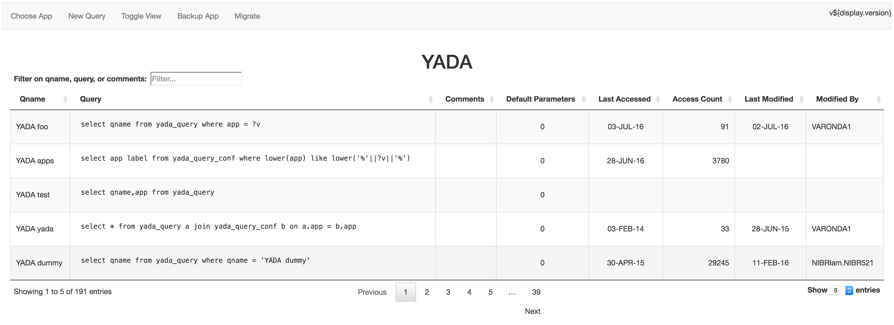
### Toolbar
The application menubar enables you to switch apps, create a query, toggle the query code format, backup the queries to a JSON text file, or migrate queries from one YADA index to another.

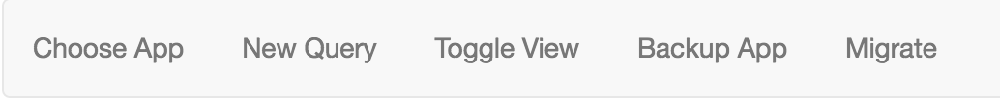

## Apps

### Switching
To switch between apps, click the `Choose App` button:

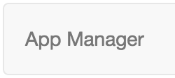

The dialog will appear with an auto-complete dropdown.  Click or Down-arrow/Enter on your app of interest.

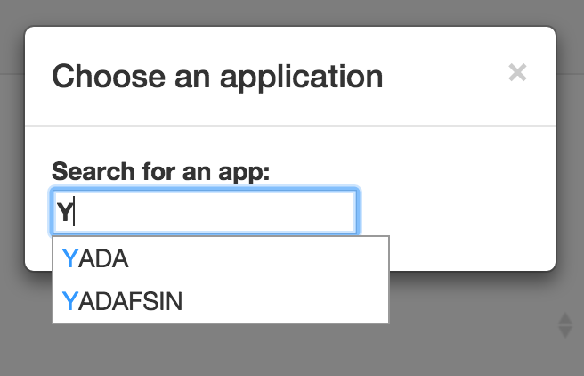

### Backup
To backup the queries for the currently selected application to a JSON text file, simply click the "Backup App" button.

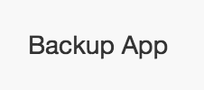

This will create a local file entitled `<APP>_YADA_backup.json`.  

The format of the file is is a fully formed YADA JSONParams string containing the query `YADA new query`, intended to enable simple reaccession of all the queries contained therein (for example by passing the content to a curl command.) 

This is intended as a either a disaster recovery or version control mechanism. One can, for example, periodically use the backup feature and commit the current version to svn, github, etc.

> NOTE: It is important that before this file is sent in a YADA request, that all the queries contained in therein are deleted from the target system first, lest they be duplicated.

Sample backup file:  

```json
[{"qname":"YADA new query",
  "DATA":[
  {"ACCESS_COUNT":"91","CREATED_BY":"UNKNOWN1","APP":"YADA","QUERY":"select qname from yada_query where app = ?v","DEFAULT_PARAMS":"0","MODIFIED":"2016-07-02 03:10:52","QNAME":"YADA foo","COMMENTS":"","LAST_ACCESS":"2016-07-03 09:44:11.533","MODIFIED_BY":"VARONDA1","CREATED":"2016-05-21 13:28:39"},
  {"ACCESS_COUNT":"3780","CREATED_BY":"","APP":"YADA","QUERY":"select app label from yada_query_conf where lower(app) like lower('%'||?v||'%')","DEFAULT_PARAMS":"0","MODIFIED":"","QNAME":"YADA apps","COMMENTS":"","LAST_ACCESS":"2016-06-28 16:14:09.652","MODIFIED_BY":"","CREATED":""},
  {"ACCESS_COUNT":"","CREATED_BY":"YADABOT","APP":"YADA","QUERY":"select qname,app from yada_query","DEFAULT_PARAMS":"0","MODIFIED":"","QNAME":"YADA test","COMMENTS":"","LAST_ACCESS":"","MODIFIED_BY":"","CREATED":""},
  ...
  ]
}]
```

## Queries

Any changes to queries made in the `yada-admin` tool result in updating of the in-memory [ehcache](http://www.ehcache.org/), via the [CachedQueryUpdater](http://opensource.nibr.com/YADA/yada-api/apidocs/com/novartis/opensource/yada/plugin/CachedQueryUpdater.html) post-processor plugin (see the [Plugin Guide].)

> Note that queries which are updated directly in the YADA Index using a command-line or GUI tool other than yada-admin, do not refresh in the cache automatically, which can result in confusion. If you do edit queries directly, it is recommend to run the [CacheUpdater](http://opensource.nibr.com/YADA/yada-api/apidocs/com/novartis/opensource/yada/plugin/CachedUpdater.html) plugin via your web browser, or curl command. 
> 
> ```
> http://localhost:8080/YADA-Quickstart-6.0.0/yada.jsp?q=YADA default&pl=CacheUpdater
> ```

### Creating
To create a query, make sure the app to which the query pertains is active, the click the `New Query` button:

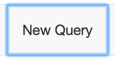

The `Edit Query` dialog will pop up:


Enter the query name in the `Qname` field.  It is not required, but it is **HIGHLY RECOMMENDED** to preface the query name with the app code, e.g., `MYAPP insert gumbo` or `MYAPP select fnords`.  The name of the app is automatically added to the Qname field to facilitate this.

Then just type your code with appropriate YADA markup in code box, and click Save.

Note that comments (i.e., documentation) can also be included.

YADA will inform you with a confirmation that the query was saved.

### Modifying

To modify a query, click on the row containing the query you wish to edit.  The `Edit Query` dialog will appear again, pre-populated, as well as with the Default Parameter options (see below.)

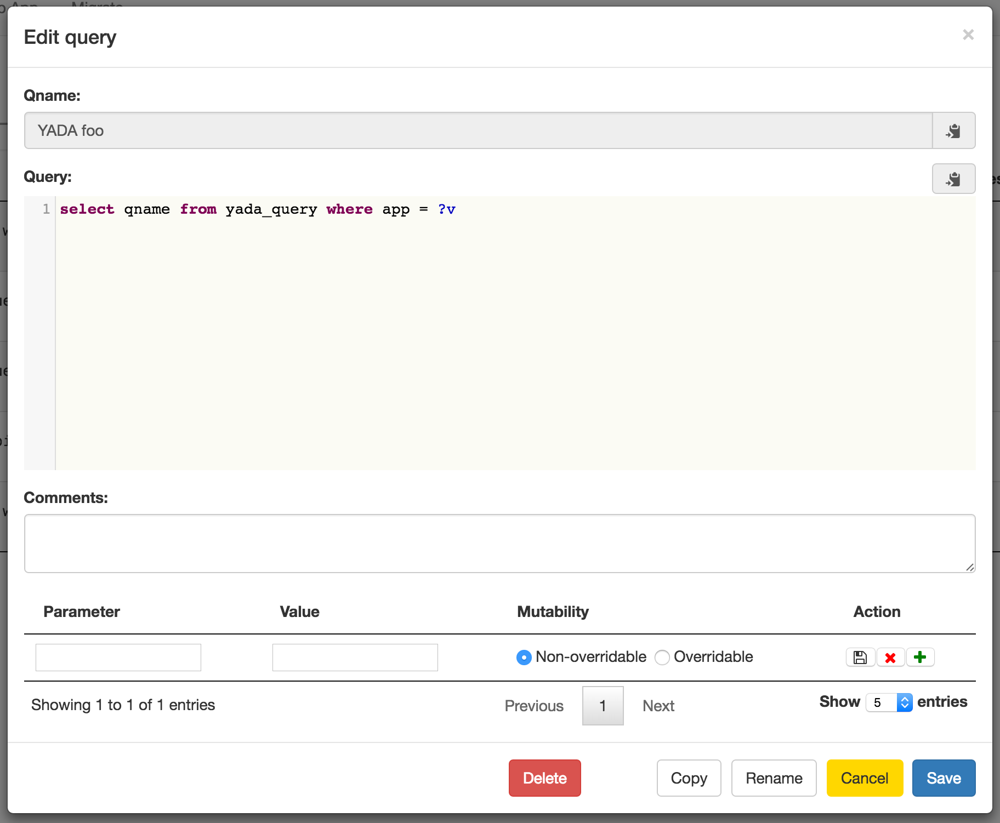

Note that comments (i.e., documentation) can also be included.

Also, note the `Qname` and `Query` can easily be copied to your clipboard with the copy buttons.

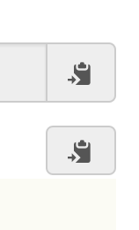

Remember to click `Save` after making your changes.

YADA will inform you with a confirmation that your changes were saved.

### Deleting

To delete a query, click on the row containing the query you wish to edit.  The `Edit query` dialog will again appear.  Click the `Delete` button, and then confirm your intention to delete.

YADA will inform you with a confirmation that the query was deleted.  This is currently an irreversible process.  Once you've deleted a query, it's gone.

### Renaming

Click the `Rename` button and a dialog box will appear with the value `<APP> RENAME <qname>`:

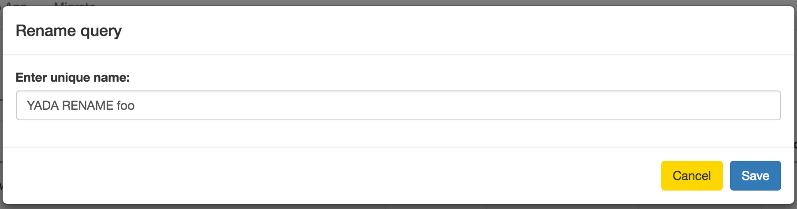 

### Copying

Click the `Copy` button and a dialog box will appear with the value `<APP> Copy of <qname>`:

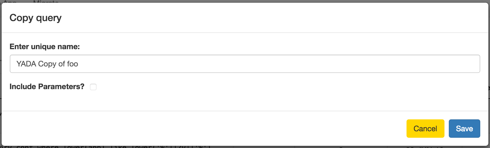 

You have the option of including or excluding any YADA default parameters that might be set on the original query.

### Filtering

To filter the visible queries in the queries list by any string in the `qname` or `query` column, just type it in the filter box.  The found set of queries will reduce instantly.

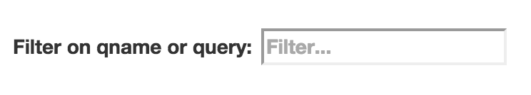


## Default YADA Parameters

Technically, YADA queries will not execute without some "default" parameters such as `JSONParams` or in its absence, `qname`.  Some YADA parameters have default values, like `format`, which is automatically set to `json` unless set explicitly to something else (see the [YADA Parameter Specification] for details.) Outside of these defaults, no YADA queries have explicit default parameters.

A default YADA parameter is tantamount to hardcoding a parameter and static value in a YADA request; to include it every time that query is requested. Some use cases for default YADA parameters include:

* **Security**: include the `cookie` or `ck` parameter to ensure that every time your REST query executes, your authentication cookie is passed through to the target service.
* **Compatibility**: Some JDBC-compatible datasources do not support open cursors after commit, causing errors to be thrown unless the default `count=true` or `c=true` is explicity changed to false. Storing this as a default YADA parameter takes the headache out of usage.
* **Convenience**: It saves you the trouble of including a specific parameter everywhere you use the specified query. For example, if you always want an entire result set, rather than a paginated one, use `pz=-1` in the URL _every time_, or better, set it as a default YADA param in the admin tool.

### Creating

To add a default YADA parameter to a query, start typing in the `Parameter` input box. An auto-suggest menu will appear.  If you don't know what a particular parameter means, roll over the menu item to see the popup hint.  Click on it to select it.

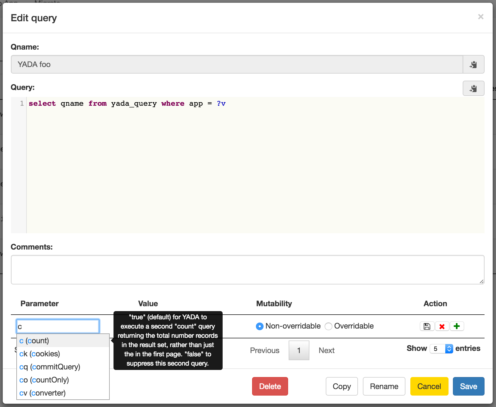

Note that some YADA parameters expect boolean values, some integers, etc.  The `Value` input control should change based on your selection and validate your input as well.

--

#### Mutability or Overridablity

Some parameters set by default should not be overridable by re-setting them in a request's URL string or POST content. Think security, for example. If you want to execute a security preprocessor plugin before your query is executed, it wouldn't be too helpful to allow a developer to circumvent the default plugin execution.  Choosing `non-overridable` (the default) will prohibit modification of the setting.

--

To save the new default YADA parameter, click the disk icon. To add another, click the plus icon.

Don't forget to click the `Save` button for the dialog as well.

### Modifying

Any default YADA parameter can be modified in the same manner as creating.  Don't forget to click the `Save` button for the dialog as well.

### Deleting

To delete a default YADA parameter click the red X next to the parameter you wish to delete.  Don't forget to click the `Save` button for the dialog as well.

## Toggle View

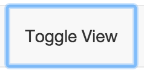

Just try it.  It changes the format of the `Query` column from monospaced, syntax-aware, pre-formatted html to proportional font with fluid text. This is basically just to facilitate seeing more rows in the table vs seeing more detail in your code.

## Migrating

Migration is a bit more involved.  

Migration effectively means copying selected queries from one YADA index to another.  There are a few prerequisites:

1. The source and target YADA indices should both be at same framework version.
2. The target YADA index host must be configured in the source host's `yada-admin/config.json` file. This is what enables it to appear in the migration dialog drop-down menu.
2. The app selected for migration must be configured in both YADA indices.
2. There must be discrepancies in the query code and/or default parameters between the two YADA indices for any queries to appear in the diff tool.
3. [Cross-Origin Resource Sharing](https://developer.mozilla.org/en-US/docs/Web/HTTP/Access_control_CORS) (CORS) can pose a problem with migration, because the transfer is performed by browser-based YADA requests to the target system, whereas the admin-tool is hosted on the source system. The [Quickstart/Deployment Guide] has some tips for overcoming this.

To begin migration, click the `Migrate` button in the toolbar.


A modal popup with autosuggest will appear.  Start typing the name of the target YADA index, e.g., test.


Select your target of choice.  The yada-admin migration diff table will appear:

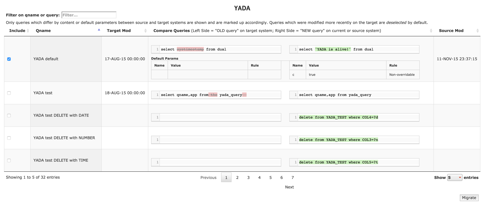

There are a few things to note:

* Queries in the source YADA index appear on the right side. Queries in the target YADA index appear on the left side. The [Mergely](http://www.mergely.com/) javascript diff tool is used for the diff table, and it inverts the highlighting when ordering the columns the other way. This column order, target->source seems off at first, but the inverted highlighting was just wrong. If it makes more sense to do so, think of the table as showing the the target is changing FROM the left hand content TO the right hand content.
* Only queries which differ by content, or parameter settings will appear in the table.
* Only queries which are have a more recent modification time in the source YADA index than in the target YADA index will be selected for migration by default in the first column.  All queries in the table are selectable but not all are selected by default.
* Queries that exist only in the source YADA index will appear entirely highlighted, and their counterparts in the target will be empty.
* Only queries selected in the first column will be migrated.
* Queries that have different default YADA parameters will also deplay the parameter differences (see the `YADA default` query in the image.)

Once you've selected the queries you wish to transfer, click the `Migrate` button in the bottom right below the table.

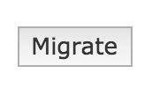

The UI will refresh. If you selected all the rows of the table, indicated there are no more queries to migrate. If you selected only some of the rows, only those previously unselected should appear.

[Plugin Guide]: pluginguide.md
[Quickstart/Deployment Guide]: deployment.md
[User Guide]: guide.md
[YADA Parameter Specification]: params.md