# Admin Guide for Query Authors

<div style="float:right;margin-top:-43px;">
    
</div> 

> NOTE: The term `YADA app` is effectively synonymous with `YADA datasource`

 

## Installed and Oriented?

See the [Quickstart/Deployment Guide] if you've not yet installed YADA on a server somewhere.  
See the [User Guide] if you're not sure what you're going to do with admin tool.
Skip to the [Security Wizard] section if that's what you need.


## Where is yada-admin?

YADA ships with a webapp called **yada-admin**. It should be accessible after install at your `YADA context/yada-admin` url.  For example, if you installed the quickstart app version 6.0.0 on your localhost in a default tomcat config (port 8080,) the yada-admin app would be accessible at

```
http://localhost:8080/YADA-Quickstart-6.0.0/yada-admin
```
## Logging in
* Use user `test`, and password `testt` to poke around in the quickstart config.  
* Look at the `YADA_USER` table for usernames/passwords.  
* Add a row to `YADA_UG` (yada user/group) table to grant access to a user for an app and its queries.  
* `ADMIN` roles get to add new apps, and create, update, delete queries.  
* `USER` roles get read-only access.
* All of this stuff is modifiable


## Using yada-admin
**yada-admin** enables the following activity:

1. Configure access to JDBC, SOAP, REST, or FILE datasources, also known as *YADA apps*.
2. Activate or deactivate apps (queries associated to inactive apps cannot be executed)
2. Create new JDBC, SOAP, REST, or FILE queries for configured YADA apps using the syntax-coloring-enabled editor from [CodeMirror](https://codemirror.net/)
3. Modify existing queries
4. Rename existing queries
5. Copy (duplicate) existing queries with a new name
4. Delete existing queries
5. Assign new default YADA parameters with values for existing queries
6. Modify default YADA parameters and values
7. Delete default YADA parameters
8. Implement simple or complex security configurations on a per query basis
9. Restrict execution of all queries for an application
8. Update in-memory cache with new query versions and configuration automatically
9. Backup all queries for the currently selected app to a JSON text file
8. Switch between YADA apps 
9. Toggle query format from monospace and pre-formatted to proportional and fluid (useful for large queries which consume your whole screen.)
10. Filter query list on `qname` and `query` content to more easily find the queries for which you're looking
11. Sort the query list
12. Migrate queries and associated default YADA parameters from one YADA index to another, e.g., DEV to TEST, or TEST to PROD.
13. View diffs of query and default YADA parameter versions between different YADA indices, e.g., DEV and TEST 

### YADA Markup Refresher

As elucidated in the [User GUide], for authoring queries, use the following markup for parameter symbols:

|Markup|Definition             |Description                  |
|:----:|:----------------------|:----------------------------|
|?v    |VARCHAR, VARCHAR2, CHAR|Any character-based data type|
|?i    |INTEGER, INT           |Any integer data type        |
|?n    |NUMBER, DECIMAL        |Any floating point data type |
|?d    |DATE                   |Any date data type           |
|?t    |TIME                   |Any time data type           |

## The UI
It looks like this (hopefully, most of the time:)


### Toolbar
The application menubar enables you to switch apps, create a query, toggle the query code format, backup the queries to a JSON text file, or migrate queries from one YADA index to another.


## App Manager

### Switching
To switch between apps, click the `App Manager` button. This will bring you to the 


This will bring you to the **App Manager** page, where you will see a list of buttons with App names, and "Queries" buttons to right.

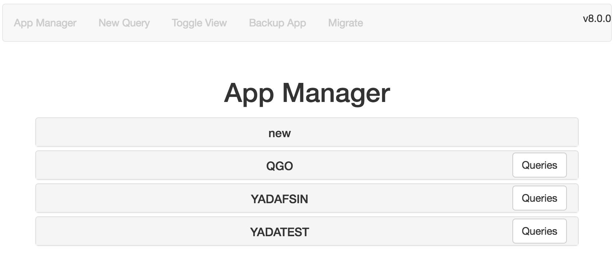

### Creating an App

Simply click the "new" item at the top of the App list directly under **App Manager**. The panel will open with placeholders and (JDBC) defaults, to help you configure the app. 

Some conventions apply:

* The `Code` field is typically all caps and 3 characters.
* The `Name` field is a short name, for example what you call the datasource when speaking about it.
* The `Description` is useful for others, or to remind you in 4 years why you configured the source in the first place.
* The `Configuration` field is where, for **JDBC**, all your connection pool properties should be entered. Defaults settings are preconfigured, except where the value *<replace>* is present. Also, a link to [HikariCP](https://github.com/brettwooldridge/HikariCP) documentation is provided in a comment in this field. **JDBC** configurations are converted to Java [Properties](https://docs.oracle.com/javase/7/docs/api/java/util/Properties.html) objects at runtime, so the syntax of the `Configuration` field must conform to that specification. Simply put, properties are `key=value` pairs separated by line feeds (newlines). `value` may contain `=` (equals sign) characters, spaces, etc. Be careful not to include trailing spaces in `value` strings unintentionally. Again, see the [HikariCP](https://github.com/brettwooldridge/HikariCP) docs for details on all acceptable `key=value` options, as well as how to include custom-driver-only properties.

For **REST**, **SOAP**, and **Filesystem** datasources, simply put the appropriate URL in this field. See the examples below.

Also, don't forget to make the app "Active" if desired, and click "Save".

#### Preliminary JDBC example
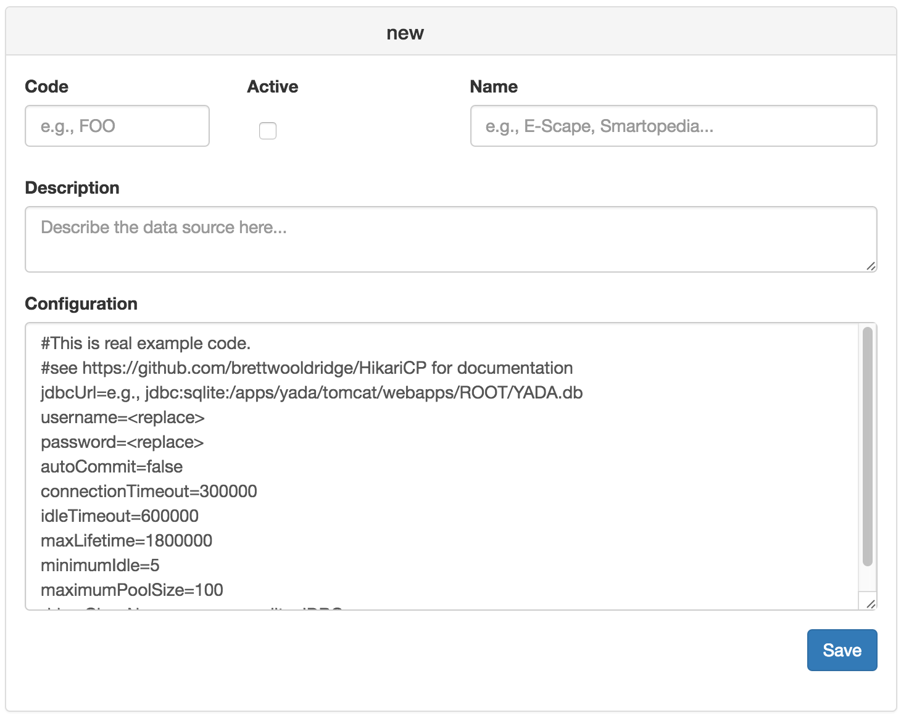

#### Completed REST example
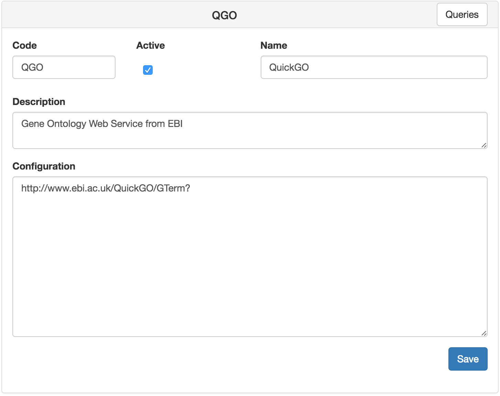

### Changing an App configuration

Simply click on the name of the app in the list, make your changes and save.  The UI will indicate if changes were successful.

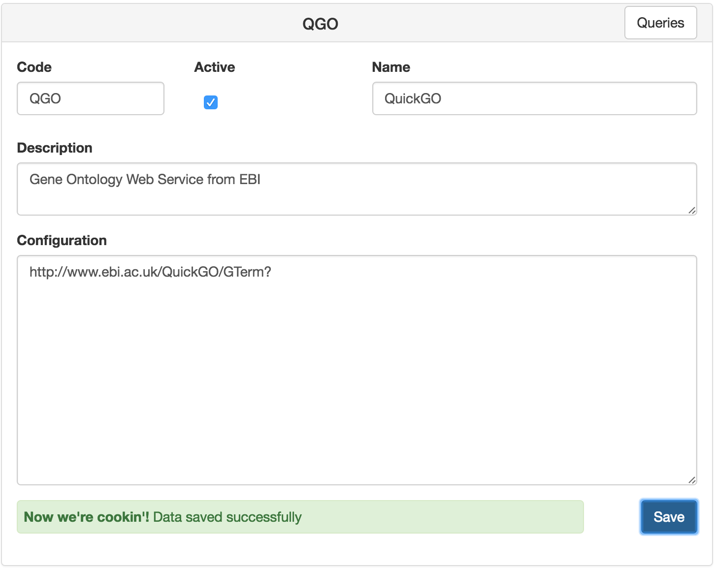

## Queries

To view, create, edit, or delete queries for a particular app, start by clicking the `Queries` button to the right of the app's name in App Manager.

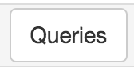

Any changes to queries made in the `yada-admin` tool result in updating of the in-memory [ehcache](http://www.ehcache.org/), via the [CachedQueryUpdater](http://opensource.nibr.com/YADA/yada-api/apidocs/com/novartis/opensource/yada/plugin/CachedQueryUpdater.html) post-processor plugin (see the [Plugin Guide].)

> Note that queries which are updated directly in the YADA Index using a command-line or GUI tool other than yada-admin, do not refresh in the cache automatically, which can result in confusion. If you do edit queries directly, it is recommend to run the [CacheUpdater](http://opensource.nibr.com/YADA/yada-api/apidocs/com/novartis/opensource/yada/plugin/CachedUpdater.html) plugin via your web browser, or curl command. 
> 
> ```
> http://localhost:8080/YADA-Quickstart-6.0.0/yada.jsp?q=YADA default&pl=CacheUpdater
> ```

### Creating
To create a query, make sure the app to which the query pertains is active, the click the `New Query` button:


The `Edit Query` dialog will pop up:


Enter the query name in the `Qname` field.  It is not required, but it is **HIGHLY RECOMMENDED** to preface the query name with the app code, e.g., `MYAPP insert gumbo` or `MYAPP select fnords`.  The name of the app is automatically added to the Qname field to facilitate this.

Then just type your code with appropriate YADA markup in code box, and click Save.

Note that comments (i.e., documentation) can also be included.

YADA will inform you with a confirmation that the query was saved.

### Modifying

To modify a query, click on the row containing the query you wish to edit.  The `Edit Query` dialog will appear again, pre-populated, as well as with the Default Parameter options (see below.)


Note that comments (i.e., documentation) can also be included. This is also where the [Security Wizard] can be found to implement a protection scheme for a query.  (See the [Security Guide] for details.

Also, note the `Qname` and `Query` can easily be copied to your clipboard with the copy buttons.


Remember to click `Save` after making your changes.

YADA will inform you with a confirmation that your changes were saved.

### Deleting

To delete a query, click on the row containing the query you wish to edit.  The `Edit query` dialog will again appear.  Click the `Delete` button, and then confirm your intention to delete.

YADA will inform you with a confirmation that the query was deleted.  This is currently an irreversible process.  Once you've deleted a query, it's gone.

### Renaming

Click the `Rename` button and a dialog box will appear with the value `<APP> RENAME <qname>`:

 

### Copying

Click the `Copy` button and a dialog box will appear with the value `<APP> Copy of <qname>`:

 

You have the option of including or excluding any YADA default parameters that might be set on the original query.

### Filtering

To filter the visible queries in the queries list by any string in the `qname` or `query` column, just type it in the filter box.  The found set of queries will reduce instantly.


<a name="secwizard"></a>
## Iard
As of version 7.1.0 there is a new wizard-like interface for securing data and query execution. As explained in the [Security Guide], protecting your data is acheived through four optional tiers of configuration:

1. **URL Pattern Matching** (reject any query requested of the wrong url, host, path, etc)
2. **Token Validation** (confirm the identity of a user)
3. **Execution policies** (prohibit unauthorized execution of queries)
4. **Content policies** (i.e., row-level filtering)

Click on the `Security` panel header to expand the Security Wizard.

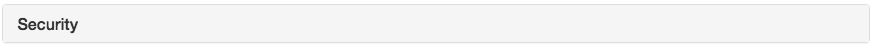

The panel opens:

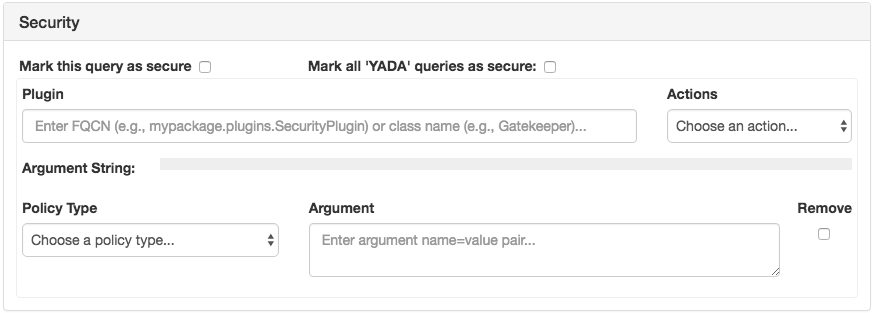

### Mark this query as secure

It is possible to restrict execution of any query without proceeding to define the details of the protection scheme.  This is done by clicking on the "**Mark this query as secure**" checkbox highlighted in the image below:

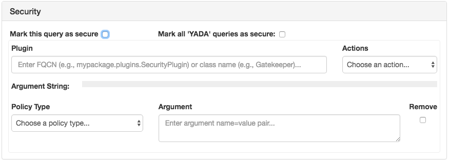

When checked, as below, the query will fail execution with a `YADASecurityException`, returning the message `Unauthorized`. HTTP requests to such a query will be returned with a `Status = 403, Forbidden`

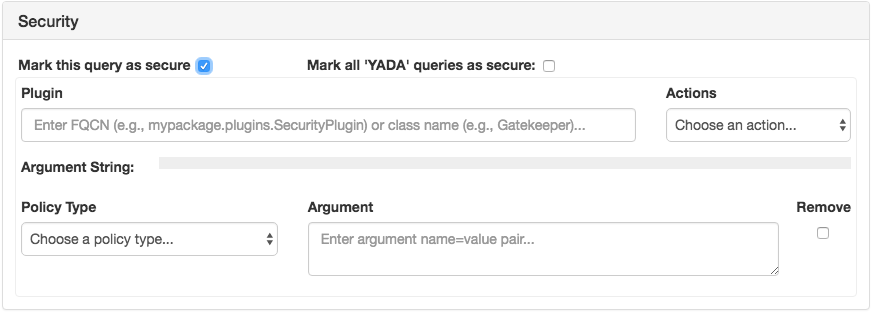

### Mark all *APP* queries as secure

The next checkbox, "**Mark all *APP* queries as secure**" will have the same effect but for all queries mapped to ***APP***. ==Be very careful with this setting once your *APP* goes into production. It will disable execution of any *APP* queries for which a more specific protection scheme has not been implemented.== Specifically, if an *APP* is marked thusly, any *APP* query request will cause a `YADASecurityException` to be thrown until it has a security preprocessor plugin configured for it. 

This checkbox exists essentially to lock down apps under development that will eventually have more granular protection scheme implementations. It is not acceptable nor advisable to leave data vulnerable during development.

### Plugin

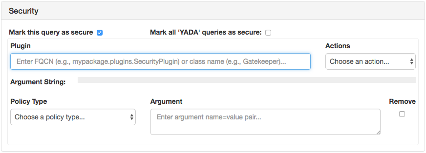

The plugin field, highlighted in blue above, is rather self explanatory. It is analogous to the first argument of the `pl` or `plugin` URL parameter value. Thus, the same rules apply. The value must be a java class name or fully-qualified java class name referencing a subclass of `AbstractPreprocessor` or `Gatekeeper` implementation of one or more of the following interfaces `SecurityPolicy`, `ExecutionPolicy`, `ContentPolicy`, `Validation`, or `TokenValidator`.

`Gatekeeper` is an effective option for most use-cases.  See the [Security Guide] for more information.

### Actions

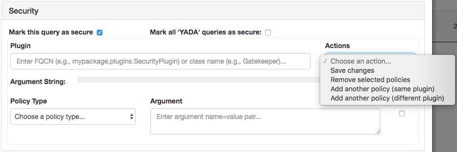

This is referenced next because it appears next, but it is not required to be used next. 

What does each option do?

#### Save changes

`Save changes` is an essential step in protection scheme implementation.  Choosing this menu item performs the following tasks:

* Saves the current state of the default parameter and related properties to the YADA index.
* Updates the in-browser cache of default parameter and property data enabling the bookkeeping required to facilitate changes in the `Security` panel, as well synchronization of the `Security` and `Default Parameters` panel.

**==You must click `Save changes` to store your current protection scheme.==** Omitting this step and clicking the blue `Save` button at the bottom of the `Edit Query` modal dialog box will not produce the desired results.

#### Remove selected policies

Click the `Remove` checkbox, highlighted in blue below, next to the policies you wish to delete from the protection scheme.  Choosing `Remove selected polities` will update the user interface and in-browser cache of security metadata (i.e., parameters and properties.) **==You must still click `Save changes` to update the protection scheme in the YADA index==**

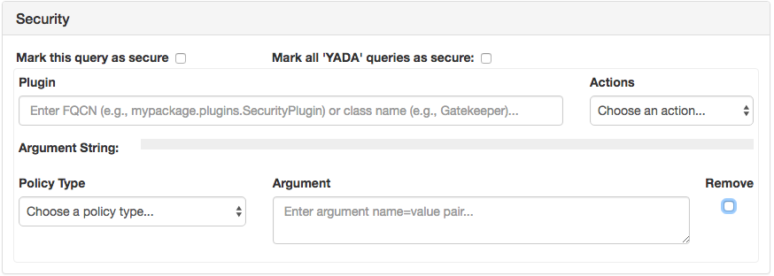 

#### Add another policy (same plugin)

Choose this menu item to add multiple security policies to your implementation. For example perhaps you want both a Content Policy and an Execution Policy.  This menu item will facilitate that.  Pictured below is the security panel with two policy sections:

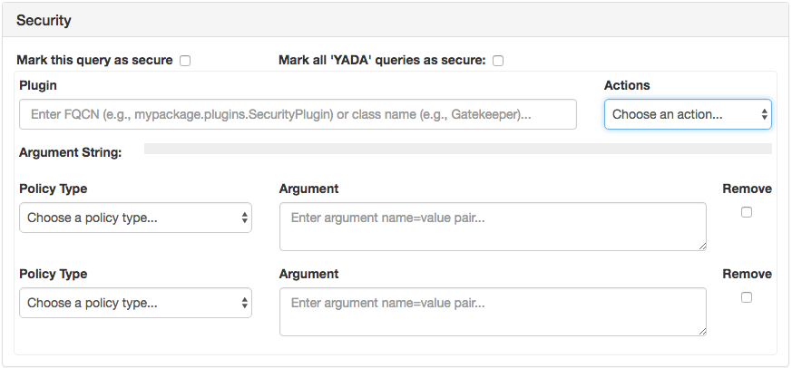

**==You must still click `Save changes` to update the protection scheme in the YADA index==**

#### Add another policy (different plugin)

Sometimes you may want or need to use, for example, `Gatekeeper` for execution and content policies, but a custom plugin for `Token Validation`.  This menu item facilitates that and similar use cases.  Pictured below is the result of choosing this menu item:

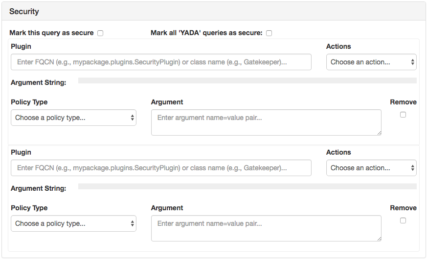

**==You must choose `Save changes` from the menu next to each plugin to retain the recent changes to that protection scheme.==** The `Actions` menu only pertains to the nearest plugin.

<a name="argstr"></a>
### Argument String

The argument string is a read-only element that displays the current configuration as if it were a URL parameter (omitting the plugin name from the first position).  Below is an example of a triple-protection scheme using URL pattern matching, and execution and content policies:

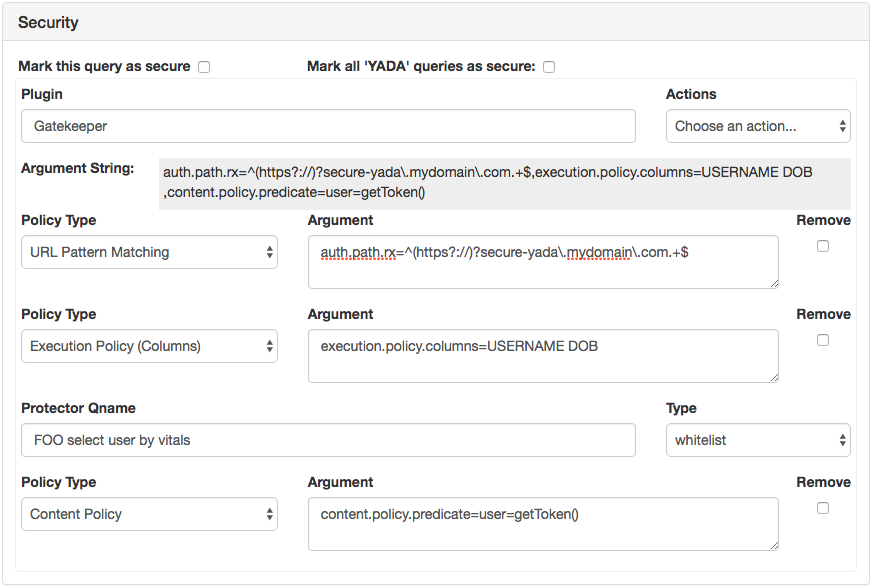

Note that the *APP* to which the protector query for the execution policy belongs is `FOO` but the query it is protecting belongs to `YADA`. This is perfectly fine. In fact, it enables one to create a series of protector queries that might refer to a credential store shared across multiple apps.

### Policy Type

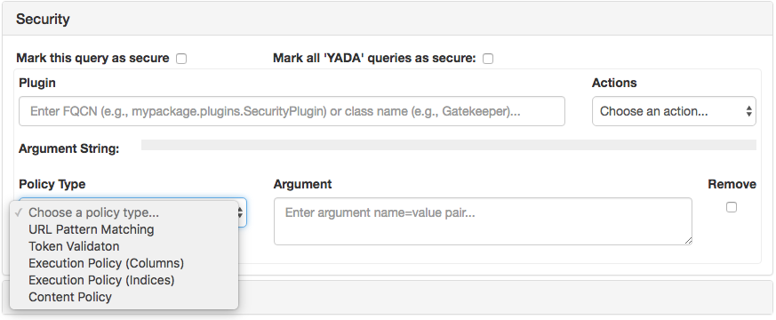

Each selection in the `Policy Type` drop-down potentially adds a security policy string to the default parameter proprocessor plugin argument string. The word *potentially* is used to remind you you must still **save changes** before the settings are retained.

Making a selection from the `Policy Type` drop down will add required text to the `Argument` textarea, as in the image below.

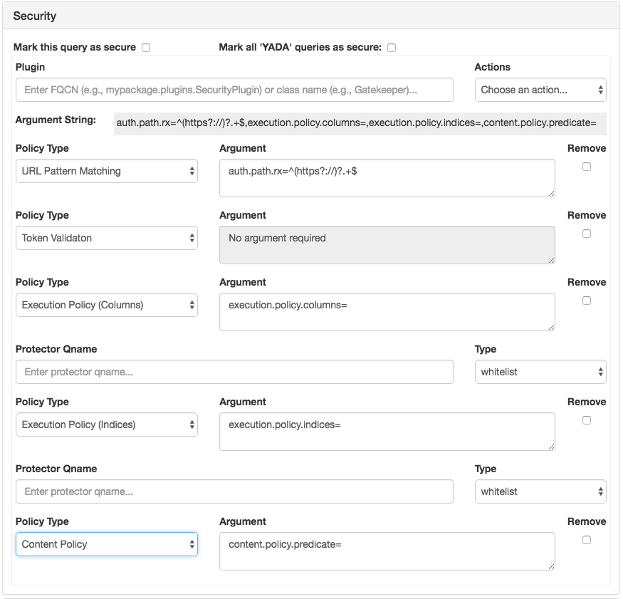

The text entered into the argument field upon seletion is the `name` portion of the argument `name=value` pair. The `value` is required to be entered by the user.  

A few things to note:

1. The `Token Validation` option results in the value `No argument required` and disabling of the textarea.  This option is in the list to facilitate configuration, but it does not have any affect. It also will not appear on subsequent re-displays of the security wizard whether or not it is employed.
2. As explained in the [Security Guide], Execution Policy (Columns) and Execution Policy (Indices) are neither incompatible nor mutually exclusive. It may be preferable to use them both. 
3. Also explained in the guide is the requirement to map a "Protector Query" to a "Protected Query" in an execution policy scheme. When selecting either `Execution Policy` choice from the `Policy Type` dropdown, the `Protector Qname` field appears. For the moment, this field must contain the same value for both choices, if both choices are used.
4. Also explained in the guide is the fact that a "Protector Query" must be assigned a `Type`. A `whitelist` is expected to return at least 1 row to permit query execution. A `blacklist` must return zero rows to permit execution.

For more information, see the [Security Guide].

> Note: A word about yada-admin app security. It's coming...
> 
> A default implementation will be provided which will enable a standard, manually curated user/group/role option for locking down the admin app.  We want this implementation to be easily swappable or compatible with your organization's existing security infrastructure, so we are taking a little extra time to facilitate that feature.


## Default YADA Parameters

Technically, YADA queries will not execute without some "default" parameters such as `JSONParams` or in its absence, `qname`.  Some YADA parameters have default values, like `format`, which is automatically set to `json` unless set explicitly to something else (see the [YADA Parameter Specification] for details.) Outside of these defaults, no YADA queries have explicit default parameters.

A default YADA parameter is tantamount to hardcoding a parameter and static value in a YADA request; to include it every time that query is requested. Some use cases for default YADA parameters include:

* **Security**: include the `cookie` or `ck` parameter to ensure that every time your REST query executes, your authentication cookie is passed through to the target service.
* **Compatibility**: Some JDBC-compatible datasources do not support open cursors after commit, causing errors to be thrown unless the default `count=true` or `c=true` is explicity changed to false. Storing this as a default YADA parameter takes the headache out of usage.
* **Convenience**: It saves you the trouble of including a specific parameter everywhere you use the specified query. For example, if you always want an entire result set, rather than a paginated one, use `pz=-1` in the URL _every time_, or better, set it as a default YADA param in the admin tool.

### Creating

To add a default YADA parameter to a query, start typing in the `Parameter` input box. An auto-suggest menu will appear.  If you don't know what a particular parameter means, roll over the menu item to see the popup hint.  Click on it to select it.


Note that some YADA parameters expect boolean values, some integers, etc.  The `Value` input control should change based on your selection and validate your input as well.

--

#### Mutability or Overridablity

Some parameters set by default should not be overridable by re-setting them in a request's URL string or POST content. Think security, for example. If you want to execute a security preprocessor plugin before your query is executed, it wouldn't be too helpful to allow a developer to circumvent the default plugin execution.  Choosing `non-overridable` (the default) will prohibit modification of the setting.

--

To save the new default YADA parameter, click the disk icon. To add another, click the plus icon.

Don't forget to click the `Save` button for the dialog as well.

### Modifying

Any default YADA parameter can be modified in the same manner as creating.  Don't forget to click the `Save` button for the dialog as well.

### Deleting

To delete a default YADA parameter click the red X next to the parameter you wish to delete.  Don't forget to click the `Save` button for the dialog as well.

## Toggle View


Just try it.  It changes the format of the `Query` column from monospaced, syntax-aware, pre-formatted html to proportional font with fluid text. This is basically just to facilitate seeing more rows in the table vs seeing more detail in your code.

## Migrating

Migration is a bit more involved.  

Migration effectively means copying selected queries from one YADA index to another.  There are a few prerequisites:

1. The source and target YADA indices should both be at same framework version.
2. The target YADA index host must be configured in the source host's `yada-admin/config.json` file. This is what enables it to appear in the migration dialog drop-down menu.
2. The app selected for migration must be configured in both YADA indices.
2. There must be discrepancies in the query code and/or default parameters between the two YADA indices for any queries to appear in the diff tool.
3. [Cross-Origin Resource Sharing](https://developer.mozilla.org/en-US/docs/Web/HTTP/Access_control_CORS) (CORS) can pose a problem with migration, because the transfer is performed by browser-based YADA requests to the target system, whereas the admin-tool is hosted on the source system. The [Quickstart/Deployment Guide] has some tips for overcoming this.

To begin migration, click the `Migrate` button in the toolbar.


A modal popup with autosuggest will appear.  Start typing the name of the target YADA index, e.g., test.


Select your target of choice.  The yada-admin migration diff table will appear:


There are a few things to note:

* Queries in the source YADA index appear on the right side. Queries in the target YADA index appear on the left side. The [Mergely](http://www.mergely.com/) javascript diff tool is used for the diff table, and it inverts the highlighting when ordering the columns the other way. This column order, target->source seems off at first, but the inverted highlighting was just wrong. If it makes more sense to do so, think of the table as showing the the target is changing FROM the left hand content TO the right hand content.
* Only queries which differ by content, or parameter settings will appear in the table.
* Only queries which are have a more recent modification time in the source YADA index than in the target YADA index will be selected for migration by default in the first column.  All queries in the table are selectable but not all are selected by default.
* Queries that exist only in the source YADA index will appear entirely highlighted, and their counterparts in the target will be empty.
* Only queries selected in the first column will be migrated.
* Queries that have different default YADA parameters will also deplay the parameter differences (see the `YADA default` query in the image.)

Once you've selected the queries you wish to transfer, click the `Migrate` button in the bottom right below the table.


The UI will refresh. If you selected all the rows of the table, indicated there are no more queries to migrate. If you selected only some of the rows, only those previously unselected should appear.

## Backup
To backup the queries for the currently selected application to a JSON text file, simply click the "Backup App" button.


This will create a local file entitled `<APP>_YADA_backup.json`.  

The format of the file is is a fully formed YADA JSONParams string containing the query `YADA new query`, intended to enable simple reaccession of all the queries contained therein (for example by passing the content to a curl command.) 

This is intended as a either a disaster recovery or version control mechanism. One can, for example, periodically use the backup feature and commit the current version to svn, github, etc.

> NOTE: It is important that before this file is sent in a YADA request, that all the queries contained in therein are deleted from the target system first, lest they be duplicated.

Sample backup file:  

```json
[{"qname":"YADA new query",
  "DATA":[
  {"ACCESS_COUNT":"91","CREATED_BY":"UNKNOWN1","APP":"YADA","QUERY":"select qname from yada_query where app = ?v","DEFAULT_PARAMS":"0","MODIFIED":"2016-07-02 03:10:52","QNAME":"YADA foo","COMMENTS":"","LAST_ACCESS":"2016-07-03 09:44:11.533","MODIFIED_BY":"VARONDA1","CREATED":"2016-05-21 13:28:39"},
  {"ACCESS_COUNT":"3780","CREATED_BY":"","APP":"YADA","QUERY":"select app label from yada_query_conf where lower(app) like lower('%'||?v||'%')","DEFAULT_PARAMS":"0","MODIFIED":"","QNAME":"YADA apps","COMMENTS":"","LAST_ACCESS":"2016-06-28 16:14:09.652","MODIFIED_BY":"","CREATED":""},
  {"ACCESS_COUNT":"","CREATED_BY":"YADABOT","APP":"YADA","QUERY":"select qname,app from yada_query","DEFAULT_PARAMS":"0","MODIFIED":"","QNAME":"YADA test","COMMENTS":"","LAST_ACCESS":"","MODIFIED_BY":"","CREATED":""},
  ...
  ]
}]
```


[Security Guide]: security.md
[Plugin Guide]: pluginguide.md
[Quickstart/Deployment Guide]: deployment.md
[User Guide]: guide.md
[YADA Parameter Specification]: params.md
[Security Wizard]: #secwizard