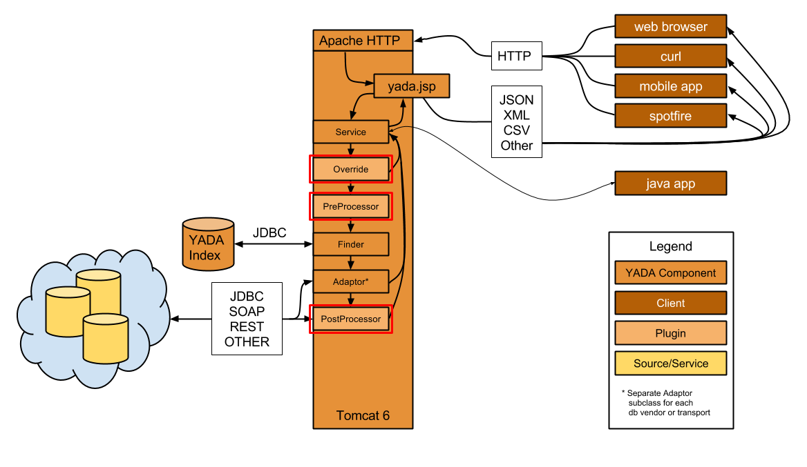

<a name="plugin"></a>
# Plugin Guide

<div style="float:right;margin-top:-43px;">
    
</div> 


YADA plugins are intended, like most plugin implementations, to extend functionality in unexpected, unpredicted (to api authors), and incredibly useful ways. 

One of the first plugin implementations for YADA included a "Loader" or ETL class which calls the Oracle® `sqlldr` to move millions of rows of RNASeq gene expression data into an Oracle® database, first transforming the data from output generated by Cufflinks.  

Another plugin exported pharmacology data, again from Oracle®, into a opendoc-compatible (.docx) Word document using a template stored as a resource.

There are two plugin API at your disposal: 

## Java® API
   
   A Java® API which enables a developer to leverage the internal YADA methods without having to use http.  Typically these are installed locally to the server as additions to the `com.novartis.opensource.yada.plugin` package. Java® plugins are introspected using the [Reflection API](https://docs.oracle.com/javase/tutorial/reflect/), and thus can be evaluated at the request level or at the query level, meaning a multi-query request can include a query that requires plugin execution, without adversely affecting it's co-requested queries.
      
## ScriptPlugin API 

   Enables any os-compatible executable stored on the server in the correct location (yada_bin) to be executed by the YADA service.  The ScriptPlugin API actually is an abstraction of the Java® Plugin API, using special Java® classes to make system calls to desired scripts. For the moment, Script Plugins can only be evaluated at the request level.
      
  
*Request-level plugins execute in red boxes*
## Java® Plugins


### Usage

To call a YADA Plugin, simply use the `plugin` or `pl` parameter, with the class name or FQCN of the plugin class as the value:

```c
# Long parameter name
hostname:port/yada.jsp?q=YADA test SELECT&plugin=TestPreprocessor

# Short parameter name
hostname:port/yada.jsp?q=YADA test SELECT&pl=TestPreprocessor 

# Fully Qualified Class Name (FQCN)
hostname:port/yada.jsp?q=YADA test SELECT&pl=com.novartis.opensource.yada.plugin.TestPreprocessor
```

To pass arguments to the plugin class, use the appropriate *arg* parameter: 

* `args`:  for any Java® plugin–the plugin type, pre, post, bypass is autodetected, so the generic args param is useful
* `preargs`, `pr`: for any preprocessor plugin
* `postargs`, `pa`: for any postprocessor plugin
* `bypassargs`, `b`: for any bypass plugin

The following examples would resolve identically:

```c
# args parameter
hostname:port/yada.jsp?q=YADA test SELECT&pl=TestPreprocessor&args=abc,def

# preargs parameter
hostname:port/yada.jsp?q=YADA test SELECT&pl=TestPreprocessor&preargs=abc,def
```
### Usage and API 

As described earlier, plugins are separated into three categories, each represented by a java interface:

#### `com.novartis.opensource.yada.plugin.Preprocess`  
for transformation of configuration parameters before queries are executed

#### `com.novartis.opensource.yada.plugin.Postprocess`  
for transformation of YADA results before they are delivered to the requesting client

#### `com.novartis.opensource.yada.plugin.Bypass`  
 to circumvent the conventional YADA process flow and effectively, do anything

Each interface has a single overloaded method: `engage`.

While the Java® interface determines the type of plugin to be executed (pre, post, bypass), it is the `engage` method signature that determines whether to engage the plugin at the request or query level.

There also exists an abstract implementation of each interface: 

#### `com.novartis.opensource.yada.plugin.AbstractPreprocessor`
to serve as a superclass for either request-level or query-level preprocessor plugin subclasses

#### `com.novartis.opensource.yada.plugin.AbstractPostprocessor`
to serve as a superclass for either request-level or query-level postprocessor plugin subclasses

#### `com.novartis.opensource.yada.plugin.AbstractBypass`
to serve as a superclass for either request-level or query-level bypass plugin subclasses

As the `engage` method is overloaded in each interface, it is better to create a plugin by extension of an abstract superclass, to override only the method relevant to the use case, i.e., request-level or query-level method signature, rather than implementing both overloaded versions of `engage`, only to use one.

#### The `Preprocess` interface  

```java
// com.novartis.opensource.yada.plugin.Preprocess request-level method
public YADARequest engage(YADARequest yadaReq) throws YADAPluginException;

// com.novartis.opensource.yada.plugin.Preprocess query-level method
public YADARequest engage(YADARequest yadaReq, YADAQuery yq) throws YADAPluginException;
```
#### The `AbstractPreprocessor` class

```java
public abstract class AbstractPreprocessor implements Preprocess
{
	/**
	 * Null implementation
	 * @see com.novartis.opensource.yada.plugin.Preprocess#engage(com.novartis.opensource.yada.YADARequest)
	 */
	@Override
	public YADARequest engage(YADARequest yadaReq) 
	   throws YADAPluginException
	{
		return null;
	}

	/**
	 * Null implementation
	 * @see com.novartis.opensource.yada.plugin.Preprocess#engage(com.novartis.opensource.yada.YADARequest, com.novartis.opensource.yada.YADAQuery)
	 */
	@Override
	public void engage(YADARequest yadaReq, YADAQuery yq) 
	   throws YADAPluginException 
	{
	   /* Nothing to do */
    }
}
```

##### The `Postprocess` interface
```java
// com.novartis.opensource.yada.plugin.Postprocess request-level method
public String engage(YADARequest yadaReq, String result) throws YADAPluginException

// com.novartis.opensource.yada.plugin.Postprocess query-level method
public String engage(YADAQuery yq) throws YADAPluginException
```

##### The `AbstractPostprocessor` class

```java
public abstract class AbstractPostprocessor implements Postprocess
{
	/**
	 * Null implementation
	 * @see com.novartis.opensource.yada.plugin.Postprocess#engage(com.novartis.opensource.yada.YADAQuery)
	 */
	@Override
	public void engage(YADAQuery yq) 
	   throws YADAPluginException 
	{ 
	   /* nothing to do */ 
	}
	
	/**
	 * Null implementation
	 * @throws YADAPluginException when there is a processing error
	 * @see com.novartis.opensource.yada.plugin.Postprocess#engage(com.novartis.opensource.yada.YADARequest, java.lang.String)
	 */
	@Override
	public String engage(YADARequest yadaReq, String result) 
	   throws YADAPluginException 
	{ 
	   return null; 
	}
}
```

##### The `Bypass` interface
```java
// com.novartis.opensource.yada.plugin.Bypass request-level method
public String engage(YADARequest yadaReq) throws YADAPluginException

// com.novartis.opensource.yada.plugin.Bypass query-level method
public YADARequest engage(YADARequest yadaReq, YADAQuery yq) throws YADAPluginException;
```

##### The `AbstractBypass` class

```java
public abstract class AbstractBypass implements Bypass
{
	/**
	 * Null implementation
	 * @see com.novartis.opensource.yada.plugin.Bypass#engage(com.novartis.opensource.yada.YADARequest)
	 */
	@Override
	public String engage(YADARequest yadaReq) 
	   throws YADAPluginException
	{
		return null;
	}

	/**
	 * Null implementation
	 * @see com.novartis.opensource.yada.plugin.Bypass#engage(com.novartis.opensource.yada.YADARequest, com.novartis.opensource.yada.YADAQuery)
	 */
	@Override
	public YADAQueryResult engage(YADARequest yadaReq, YADAQuery yq) 
	   throws YADAPluginException
	{
		return null;
	}
}
```

### Descriptions and Examples
#### Preprocess

The `Preprocess` request-level implementation takes the original `YADARequest` as an argument, passed from the `Service._execute` method, and returns the modified version of the request, or an equivalent.

```java
// com.novartis.opensource.yada.plugin.Preprocess request-level method  
public YADARequest engage(YADARequest yadaReq) throws YADAPluginException;
```

Here's an example of a request-level preprocessor. This is the implementation of the `engage` method in `com.novartis.opensource.yada.plugin.TestPreprocessor`

```java
/**
	 * Executes the query defined in {@code yadaReq} and analyzes the results.  If the
	 * result count is 0, a new request with an {@code INSERT} is query is created. If
	 * the result count is >0, a new request with a {@code DELETE} query is created.
	 * The new reqeust is then returned from the method.   
	 * @see com.novartis.opensource.yada.plugin.Preprocess#engage(com.novartis.opensource.yada.YADARequest)
	 */
	@Override
	public YADARequest engage(YADARequest yadaReq) throws YADAPluginException
	{
	  // store the original qname
		String      qname    = yadaReq.getQname();
		// create a new request object
		YADARequest lyadaReq = new YADARequest();
		// set the qname
		lyadaReq.setQname(new String[] { qname });
		// execute the new request with the original qname
		Service     svc       = new Service(lyadaReq);
		// store the result
		String      result    = svc.execute();
		
		l.debug(result);
		
		JSONObject res;
		
		try
		{
		  // eval the result as json
			res = new JSONObject(result);
			// if the result doesn't contain data, create another new request to insert it
			if(res.has("RESULTSET") && res.getJSONObject("RESULTSET").getInt("total") == 0)
			{
				lyadaReq = new YADARequest();
				lyadaReq.setQname(new String[] { "YADA test INSERT" });
				lyadaReq.setParams(new String[] { "A,10,7.5,26-SEP-2014" });
			}
			// if the result contains data, create a new request to delete it
			else if(res.has("RESULTSET") && res.getJSONObject("RESULTSET").getInt("total") > 0)
			{
				lyadaReq = new YADARequest();
				lyadaReq.setQname(new String[] { "YADA test DELETE" });
			}
			else
			// if the result is non-conforming, throw an exception
			{
				throw new YADAPluginException("Plugin failed.");
			}
		} 
		catch (JSONException e)
		{
			throw new YADAPluginException("Unable to parse result.");
		}
		// return the new locally created request object
		return lyadaReq;
	}
}
```


The `Preprocess` query-level implementation takes both the `YADARequest` and currently processing `YADAQuery` object as arguments, and again, returns a modified version of the request, or an equivalent. A `Preprocess` query-level implementation is ideal for use as a security gatekeeper, to limit execution of specified queries to authorized users. See the [Security Guide] for details and examples.

```java
// com.novartis.opensource.yada.plugin.Preprocess query-level method  
public YADARequest engage(YADARequest yadaReq, YADAQuery yq) throws YADAPluginException;
```

#### Postprocess

The `Postprocess` request-level implementation takes the existing `YADARequest` and the latest "return-ready" `String` result arguments, passed from the `Service._execute` method, and returns, typically, a transformed version of result.  However, it could return any `String`. 

```java
// com.novartis.opensource.yada.plugin.Postprocess request-level method  
public String engage(YADARequest yadaReq, String result) throws YADAPluginException;
```

Here is an example of a postprocessor. This is the implementation of the `engage` method in `com.novartis.opensource.yada.plugin.TestPostprocessor`:

```java
/**
 * Simply returns the string {@code It worked.}
 * @see com.novartis.opensource.yada.plugin.Postprocess#engage(com.novartis.opensource.yada.YADARequest, java.lang.String)
 */
@Override
public String engage(YADARequest yadaReq, String result) throws YADAPluginException
{
  // return an arbitrary string
  return "It worked.";
}
```
Obviously, a postprocessor can be much more complex. The `YADARequest` object can contain a `pa` or `postargs` array containing arguments pertinent to the plugin, and the plugin can also leverage any other parameter contained in the request.  Here's a more complex example. This is the `engage` method of the class `com.novartis.opensource.yada.XSLPostprocessor` included in the library, which relies on the `postargs` array.

```java
/**
* Instantiates a {@link TransformerFactory}, gets a new {@link Transformer} using the stylesheet
* passed in the request's {@link YADARequest#postargs}, transforms {@code result} and returns the output.
* @see com.novartis.opensource.yada.plugin.Postprocess#engage(com.novartis.opensource.yada.YADARequest, java.lang.String)
*/
@Override
public String engage(YADARequest yadaReq, String result) throws YADAPluginException {
	String xmlInput  = result;
	String xslResult = "";
	String xsl       = "";
	StringWriter output = new StringWriter();
	// 1. Instantiate a TransformerFactory.
	TransformerFactory tFactory =  TransformerFactory.newInstance();

	// 2. Use the TransformerFactory to process the stylesheet Source and generate a Transformer.
	Transformer transformer;
	try 
	{	
	   // this is where 'postargs' value in YADARequest is used
		List<String> args   = yadaReq.getPostArgs();
		for(String arg:args)
		{
			if (arg.endsWith(".xsl"))
				xsl = arg;
		}
		transformer = tFactory.newTransformer(new javax.xml.transform.stream.StreamSource(new Finder().getEnv("yada_util")+xsl));
		
		// 3. Use the Transformer to transform an XML Source and send the output to a Result object.
		setTransformerParameters(args, transformer);
		transformer.transform
	    	(new StreamSource(new StringReader(xmlInput)), 
	    	 new StreamResult(output));
		xslResult = output.getBuffer().toString();
		changeResultFormat(args, yadaReq);
	} 
	catch (TransformerConfigurationException e) 
	{
		e.printStackTrace();
		throw new YADAPluginException(e.getMessage());
	} 
	catch (TransformerException e) 
	{
		e.printStackTrace();
		throw new YADAPluginException(e.getMessage());
	} 
	catch (YADAResourceException e)
	{
		e.printStackTrace();
		throw new YADAPluginException(e.getMessage());
	} 
	
	return xslResult;
}
```

The `Postprocess` query-level implementation performs the same role as it's request-level sibling, but obviously with a single query result, extracted from the `YADAQuery` object, rather than with the entire post-format, request result.

```java
// com.novartis.opensource.yada.plugin.Postprocess query-level method
public String engage(YADAQuery yq) throws YADAPluginException
```

TODO query-level postprocessor example

#### Bypass

The `Bypass` request-level implementation takes the original `YADARequest` as an argument, passed from the `Service._execute` method, and returns any `String` suitable as a the payload of an HTTP response.  Due to the dynamic discovery and execution of plugins, if a `Bypass` implementation returns anything other than null, `Service._execute` will halt further execution and immediately return the result.

```java
// Bypass method signature
public String engage(YADARequest yadaReq) throws YADAPluginException;
```
Here is an example of a postprocessor. This is the implementation of the engage method in `com.novartis.opensource.yada.plugin.TestBypass`:

```java
/**
 * Simply returns the string {@code Bypass worked."}
 * @see com.novartis.opensource.yada.plugin.Bypass#engage(com.novartis.opensource.yada.YADARequest)
 */
@Override
public String engage(YADARequest yadaReq) throws YADAPluginException
{
	return "Bypass worked.";
}
```

The `Bypass` query-level implementation works in similar fashion but rather than returning from `Service._execute` immediately, the `Service` object will simply iterate immediately to the next query.

```java
// com.novartis.opensource.yada.plugin.Bypass query-level method
public YADARequest engage(YADARequest yadaReq, YADAQuery yq) throws YADAPluginException;
```

TODO Bypass query-level example

## Script Plugins

Script plugins adhere to the same contracts as Java® plugins. In fact, they are facilitated by built-in Java® plugins which utilize `java.lang.Process` objects to make system calls to registered scripts operating in supported scripting environments. Script plugins differ (on the Java® side) by the extra step of marshaling arguments and return values to and from the runtime and system environments.  Their implementations, however, are simple.  

> Note: Script plugins, for the moment, may only be used at the request level, not at the query level. 

To call a script plugin, simply indicate the script name, and it's arguments, in the appropriate "args" parameter in the request:

```bash
http://example.com/yada.jsp?qname=myquery&postargs=myscript.pl,arg1,arg2
```

### Rules

Note the following rules for calling and processing a Script Plugin:

1. The `plugin` or `pl` parameter is optional. If omitted, one of the following specific argument parameters must be used: `preargs`, `pr`, `postargs`, `pa`, `bypassargs`, `b`
3. If the `plugin` or `pl` parameter is included, the generic `args` or `a` parameter may be used
4. The first value in the argument parameter must be the path to the executable script, relative to the `YADA_BIN` directory
5. Any proceeding arguments should adhere to the order expected by the script denoted in the first argument
6. The arguments passed to the script will be the "stringified" versions of the values passed to the built-in Java® handler plugins' engage methods
  7. For both `ScriptPreprocessor` and `ScriptBypass` this will be a JSON representation of the `YADARequest` object
  8. For `ScriptPostprocessor` this will be both a JSON representation of the `YADARequest` object and the `String` result of the query
9. The return values of scripts must adhere to the proper syntax
  10. For `ScriptPreprocessor` the return value must be a JSON string convertible into a `YADARequest` object.  See the [script preprocessor section](#scriptpreproc_spec) for details.
  11. For both `ScriptPostprocessor` and `ScriptBypass`, the return value must be a string result effectively intended to be returned to the client

### Syntax examples
As shown in the code samples below, dynamic type detection enables the exclusion of the `plugin`, or `pl` request parameter when calling script plugins. If the parameter is excluded, however, it is critical to use the correct type-specific "args" parameter.

```c
# the following calls are equivalent

# with both plugin and type-specific args
http://example.com/yada.jsp?qname=myquery&plugin=ScriptPostprocessor&postargs=myscript.pl,arg1,arg2  

# with plugin and generic args
http://example.com/yada.jsp?qname=myquery&plugin=ScriptPostprocessor&args=myscript.pl,arg1,arg2     

# without plugin, with type-specific args
http://example.com/yada.jsp?qname=myquery&postargs=myscript.pl,arg1,arg2                            
 
 
# the following calls are also equivalent, but use the short names

# with both plugin and type-specific args
http://example.com/yada.jsp?q=myquery&pl=ScriptPostprocessor&pa=myscript.pl,arg1,arg2   

# with plugin and generic args
http://example.com/yada.jsp?q=myquery&pl=ScriptPostprocessor&a=myscript.pl,arg1,arg2    

#without plugin, with type-specific args
http://example.com/yada.jsp?q=myquery&pa=myscript.pl,arg1,arg2                          
```

<a name="scriptpreproc_spec"></a>
### com.novartis.opensource.yada.plugin.ScriptPreprocessor

Internally, the `engage` method will accept the `YADARequest` object from the `Service` object.  It will then pass it to the designated script as a string representation of parameter map obtained from the `HttpServletRequest`.  In fact, the string version of the request is nothing more then the result of calling `getParameterMap().toString()` on the `HttpServletRequest` object in the `YADARequest`.  The syntax is defined by [ServletRequest.getParameterMap](https://docs.oracle.com/javaee/6/api/javax/servlet/ServletRequest.html#getParameterMap()):
 
>an immutable java.util.Map containing parameter names as keys and parameter values as map values. The keys in the parameter map are of type String. The values in the parameter map are of type String array.

This `String` is marshalled into a JSON object with parameter names as keys, and parameter value arrays as values, and then passed to the script as a string.
The string returned by the script must comply with the same JSON syntax.  Here is a Perl example:

```perl
#!/usr/bin/perl
 
# call with an url like the following:
# http://example.com/yada.jsp?q=YADA%20test%20SELECT&pr=scriptPluginPreTest.pl,YADA%20default&c=false
 
my $qname = $ARGV[0];

# The string returned must be a representation of the
# ServletRequest.getParameterMap() return value, with 
# String objects for keys, and String arrays for values.

print '{ "qname" : ["'.$qname.'"] }';
```

### com.novartis.opensource.yada.plugin.ScriptPostprocessor

In `ScriptPostprocessor` execution, first the `String result` value is written to a temporary file. Then the plugin arguments are put into a `List`. Then the absolute path the file containing the result is appended. The list is then passed to the plugin script executable.

Here is a perl example of a ScriptPostprocessor.

First the request used to call the plugin:

```c
# some things to note:
#  a. no 'pl' or 'plugin' parameter was used
#     YADA deduces a script plugin named 'scriptPluginPostTest.pl' is
#     required by the used of the use of the 'pa' (postargs) param
#  b. no additional arguments follow the script name, so the plugin
#     itself should expect the file containing the query result 
#     in $ARGV[0]
http://example.com/yada.jsp?q=YADA test SELECT&pa=scriptPluginPostTest.pl&c=false
```

```perl
#!/usr/bin/perl

# note the filename is passed, in this case, in $ARGV[0]
# the filename will always be in the last $ARGV index
open INFILE, $ARGV[0] || die "oops";
while (<INFILE>) {
 chomp;
 $_ =~ s/RESULTSET/PLUGINWASHERE/;
 # The output of the script is retrieved by YADA and passed back
 # to the Service object as a result
 print $_;
}
```
Obviously, anything is possible in this script.  The author could leverage arguments passed in, execute additional queries, call an `R` analysis, convert the data to a proprietary format, etc.

### com.novartis.opensource.yada.plugin.ScriptBypass

The `ScriptBypass` is kind of a combination of the pre- and post-processors. It takes the `YADARequest` object as an argument to `engage` and returns a `String` suitable for a response.

Here is the content of `ScriptPluginBypassTest.pl`.  You can see it dispenses entirely with input, and returns an abitrary string.

```perl
#!/usr/bin/perl

print "What is this, velvet?\n";
```
Obviously, anything is possible in this script. The author could leverage arguments passed in the url, or in other YADA parameters. 

## Behind the Scenes

Here is flowchart of the `Service._execute` method as it relates to plugin discovery and execution. Some steps have been omitted for clarity.


Here is the pertinent snippet from `Service._execute`. Some code has been omitted for clarity.

```java
    // engage global bypass
    gResult = engageBypass(this.getYADARequest());
    if (gResult != null)
    {   
        // if a Bypass is discovered and returns anything non-null
        // the Service will stop processing and return immediately
        return gResult;
    }
    // engage global preprocessor
    engagePreprocess(getYADARequest());
    
    // iterate over the queries in the request
    for(YADAQuery yq : this.qMgr.getQueries())
    {
        // engage query bypass
        engageBypass(yq); 
        YADAQueryResult yqr = yq.getResult(); 
        if (yqr != null)
        {
            // if there is now a result in the query,
            // skip further processing and move on to the next query
            continue;
        }
        // engage query preprocessor
        engagePreprocess(yq);
        // execute query
        yq.getAdaptor().execute(yq);
        .
        .
        .
        // engage query postprocessor
        engagePostprocess(yq);
    }
    .
    .
    .
    // build response (creating response payloads)
    gResult = composeResponse();
    // engage global postprocessor
    gResult = engagePostprocess(gResult);
    .
    .
    .
```
[YADARequest]: http://opensource.nibr.com/yada/yada-api/apidocs/com/novartis/opensource/yada/YADARequest.html
[Service]: http://opensource.nibr.com/yada/yada-api/apidocs/com/novartis/opensource/yada/Service.html
[Security Guide]: security.md