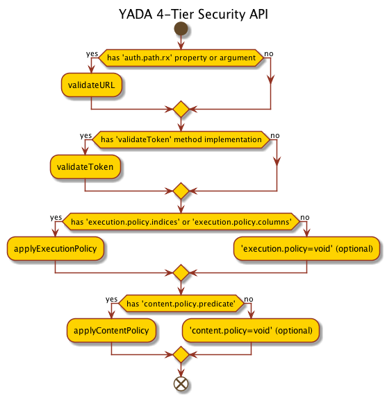

# Security Guide

<div style="float:right;margin-top:-43px;">
    
</div> 

### ==NOTE: The Plugin API has been revised for release 7.1.0. Only the `pl` parameter is required now, and arguments formerly passed with now deprecated `a`, `pr`, `pa`, or `b` parameters will instead be appended to the `pl` parameter, after the plugin class-name and a comma.  See the [Plugin Guide] for details.==

### NOTE: Also with release 7.1.0, a new Security Wizard in the yada-admin webapp will make it super-easy to configure your security implementation once you know what you want. Learn more about the Security Wizard in the [Admin Guide].

YADA Security is comprised of a four-tier cascading system featuring

1. [URL pattern matching](#featurl)
2. [Token authentication](#feattoken)
3. [Query execution protection](#featexec)
4. [Content protection](#featcontent)

The mechanism for a YADA Security implementation is a *preprocessor plugin*, configured as a *default YADA parameter* attached to the query for which protection is desired. Such a plugin, `com.novartis.opensource.yada.plugin.Gatekeeper` is provided.

When using a custom class other than `Gatekeeper` to implement security, it is still advantageous to extend `Gatekeeper`, or at least `com.novartis.opensource.yada.plugin.AbstractPreprocessor` if possible, as it contains many constants, default method implementations, and other conveniences.



## Default YADA Parameter
A *default YADA parameter* is effectively a segment of a URL parameter string, a single name-value pair, that, instead of being passed in a URL or HTTP POST content, is stored in the YADA index and linked to a query. It is a way, if you will, to amend a YADA HTTP request with a server-side configuration at request-time.

Default YADA parameters can be set as overridable (mutable) or non-overridable (immutable.) For obvious reasons, when using a default YADA parameter for security, the parameter must be set as non-overridable. This prevents a user from changing the value of the parameter by including it in the URL or POST content of the request.

Default YADA parameters are typically used to amend requests with configuration preferences, for example, to prohibit a default *count* query from executing (i.e., `c=false`) or to override default pagination by returning the complete result set with every execution (i.e., `pz=-1`)

In the context of Security, the default YADA parameter capability is used to attach a query-level preprocessor plugin that can reject a request to execute a query based on specificed criteria, or pre-filter a result set by amending the requested query before it is executed (row-level security.)

## Preprocessor Plugin
A *preprocessor plugin* is a java class or script accessible to the YADA server and compliant with the Plugin API. A preprocessor plugin will execute after a YADA request is deconstructed and it's query or queries are prepared for execution, but before the queries are executed. 

Preproccesor plugins can be attached to a request or query. Security-related preprocessor plugins are attached to queries. 

As alluded to above, the security preprocessor plugin api has four methods protecting queries from unauthorized execution and for pre-filtering data by amending queries before execution:

1. `validateURL` for url pattern matching
1. `validateToken` for token retrieval and verification
1. `applyExecutionPolicy` to prohibit unauthorized query execution
1. `applyContentPolicy` to amend query criteria (i.e., `where` clauses,) before queries are executed, to enable row-level filtering

<a name="featurl"></a>
## URL Pattern Matching
URL pattern matching is useful if a host or path is behind a security gateway.  For example, say your YADA host is on `myyada.mydomain.com`. It would be possible to map a second hostname, say `secureyada.mydomain.com` in behind an authentication service.  Then only those users with valid security tokens will be allowed access to url.

"Wait," you might say, "can't anyone just do an endrun around to the unsecured host?" The answer is, "not if the query they are requesting is protected."

Remember the query is not just for the host but also includes parameters. For example take the query:

```
http://myyada.mydomain.com/q/MY secured query/p/val

--> Status Code: 401 Unathorized
```

If this query is protected, using a default YADA parameter referencing a preprocessor plugin that implements `com.novartis.opensource.yada.plugin.Validation`, any request for that query at that host would be fail with a `401 Unauthorized` error.

Conversely, the request:

```
http://secureyada.mydomain.com/q/MY secured query/p/val

--> Status Code: 200 OK
```

would succeed.

See [below](#confurl) for how to configure this URL validation.

<a name="feattoken"></a>
## Token Validation

Token validation affords one the opportunity to validate a user is who he or she claims.  In one respect it compensates for the omission of an authentication gateway from the request process, or it's relative coarseness. 

It can also be a way to both conjure and validate a security token intended for use at a lower security tier, namely, in an [execution policy] or [content policy].

Its intented use is to compare an authenication token passed covertly in a request with a retrieved value, or to retrieve such a token in the first place using some other credential.

See [below](#conftoken) for how to configure this token validation.

<a name="featexec"></a>
## Execution Policies

Execution policies prevent unauthorized execution of queries. 

Execution policies consist of secondary queries (protectors) mapped to protected queries in the `YADA_A11N` (YADA Authorization) table, along with a `type` which must be either `blacklist` or `whitelist`.  `blacklist` policies must return zero (`0`) rows to allow protected queries to proceed. `whitelist` policies must return greater than zero (`>0`) rows.

Execution policies can be limited to standard parameter syntax, JSONParameter syntax, or can be configured to support both.

See [below](#confexec) for how to configure execution policiies along with some examples.

<a name="featcontent"></a>
## Content Policies

Content policies are the YADA way to implement row-level security in a JDBC datasource.

Content policies consist of SQL `where` conditions or predicates, dynamically applied to existing `where` clauses, or comprising new ones, e.g.,

```sql
-- DATA
-- table = YADA_TEST
-- |ROW| COL1 | COL2  | TOKEN         |
-- |---+------+-------+---------------|
-- | 1 |  Z   |  40   | YADAYADA      |
-- | 2 |  Z   |  34   | YADAYADA      |
-- | 3 |  Z   |  73   | HAM SANDWICH  |
-- | 4 |  Z   |  22   | HAM SANDWICH  |
-- | 5 |  A   |  84   | YADAYADA      |
-- | 6 |  A   |  21   | YADAYADA      |

-- Original protected query:
SELECT * FROM YADA_TEST where COL1 = 'Z'
-- > returns 4 rows (1, 2, 3, and 4)

-- Content Policy Predicate:
token = 'YADAYADA'

-- Amended proceted query:
SELECT * FROM YADA_TEST where COL1 = 'Z' AND token = 'YADAYADA'
-- > returns 2 rows (1 and 2)
```

The content policy API also supports dependency injection by allowing for the values in the policy to be subsituted with method names which refer to methods in the ContentPolicy implementer:

```sql
-- DATA
-- table = YADA_TEST
-- |ROW| COL1 | COL2  | TOKEN         |
-- |---+------+-------+---------------|
-- | 1 |  Z   |  40   | YADAYADA      |
-- | 2 |  Z   |  34   | YADAYADA      |
-- | 3 |  Z   |  73   | HAM SANDWICH  |
-- | 4 |  Z   |  22   | HAM SANDWICH  |
-- | 5 |  A   |  84   | YADAYADA      |
-- | 6 |  A   |  21   | YADAYADA      |

-- Original protected query:
SELECT * FROM YADA_TEST where COL1 = 'Z'
-- > returns 4 rows (1, 2, 3, and 4)

-- Content Policy Predicate:
token = getQToken 
-- "getQToken" in com.novartis.opensource.yada.plugin.GateKeeper 
--   returns the token value surrounded by single quotes

-- Amended proceted query:
SELECT * FROM YADA_TEST where COL1 = 'Z' AND token = 'YADAYADA'
-- > returns 2 rows (1 and 2)
```

Here's another simple example:

```sql
-- DATA
-- table = YADA_TEST
-- |ROW| COL1 | COL2  | TOKEN         |
-- |---+------+-------+---------------|
-- | 1 |  Z   |  40   | YADAYADA      |
-- | 2 |  Z   |  34   | YADAYADA      |
-- | 3 |  Z   |  73   | HAM SANDWICH  |
-- | 4 |  Z   |  22   | HAM SANDWICH  |
-- | 5 |  A   |  84   | YADAYADA      |
-- | 6 |  A   |  21   | YADAYADA      |

-- Original protected query:
SELECT * FROM YADA_TEST where COL1 = 'Z'
-- > returns 4 rows (1, 2, 3, and 4)

-- Content Policy Predicate:
token = getQHeader(USER_ID)
-- The method "getQHeader" in Gatekeeper will extract the value of the
--   named header, in this case "USER_ID" from the request, and 
--   wrap it in single quotes

-- Amended proceted query:
SELECT * FROM YADA_TEST where COL1 = 'Z' AND token = 'HAM_SANDWICH'
-- > returns 2 rows (3 and 4)
```

Content policies currently apply to JDBC datasources only.

See [below](#confcontent) for how to configure this feature.


# Configuration

<a name="confurl"></a>
## Configure URL validation
As with all YADA security configurations, two default parameters are required.  In each case the value of `Target` is the `qname` of the proteced query.  The value `qname` is used here as a placeholder.

Also:

* `pl` is the alias for the `plugin` YADA parameter
* `FQCN` = Fully Qualified Class Name, e.g., instead of `Gatekeeper`, `com.novartis.opensource.yada.plugin.Gatekeeper`. FQCN is typically only necessary if the package name is different (but class-loader issues could make a liar out of me.) In the examples below, the value `class` is used as a placeholder.
* Mutabiltiy = `1` = Non-overrideable (immutable)  
* `regex` means a regular expression, i.e `myhost\.mydomain\..+`.  
  *  The default method `AbstractPreprocessor.validateURL(String pathRx)` supports both omission and inclusion of the protocol portion of the url, i.e., i.e `http://myhost\.mydomain\..+` is also a valid regular expression to use here.
*  It is also possible to protect the entire yada server by default by setting the `auth.path.rx` value as a system property. In this case only the plugin value must be configured for those queries desired to be proctected. Again the plugin must extend `com.novartis.opensource.yada.plugin.AbstractPreprocessor`. 

### Set default parameters

> Note: this is typically (and recommended to be) completed using the yada-admin webapp.  Modifying the YADA index directly can lead to unexpected behavior, which is a big deal especially in the context of security

|Target|Name|Value|Mutability|Optional|
|:----:|:--:|:----|:--------:|:-------|
|`qname`|`pl`|`class,auth.path.rx=<regex>`|1|The class is required in all cases. The name/value pair is optional if System property `auth.path.rx` is set|

<a name="conftoken"></a>
## Configure Token Validation

### Set default parameters

> Note: this is typically (and recommended to be) completed using the yada-admin webapp.  Modifying the YADA index directly can lead to unexpected behavior, which is a big deal especially in the context of security

|Target|Name|Value|Mutability|Optional|
|:----:|:--:|:----|:--------:|:-------|
|`qname`|`pl`|`class`|1|No|

The token validation is configured only as a method in the security plugin. There is no argument.

The plugin should implement the `void validateToken()` method. The method has no return value, and should throw a `YADASecurityException` when encountering an invalid state.

This is the trivial implementation in `com.novartis.opensource.yada.plugin.Gatekeeper`:

```java
  /**
   * Overrides {@link TokenValidator#validate()}. Default sets token to value of
   * {@link #DEFAULT_AUTH_TOKEN_PROPERTY} system property.
   * 
   * @throws YADASecurityException
   *           when the {@link #DEFAULT_AUTH_TOKEN_PROPERTY} is not set
   */
  @Override
  public void validateToken() throws YADASecurityException 
  {
    String token = System.getProperty(DEFAULT_AUTH_TOKEN_PROPERTY);
    if(token == null || token.equals(""))
      String msg = "Unauthorized. " +DEFAULT_AUTH_TOKEN_PROPERTY +" system property not set."
      throw new YADASecurityException(msg);
    setToken(token);
  }
```


<a name="confexec"></a>
## Configure Execution Policy

Execution policy configuration is a little more involved. [Skip to Content Policy](#featcontent) if you like, which is *a lot* less complicated.

To configure an execution policy, the following steps must be completed:

1. Add a protector query to the YADA index using the admin tool
2. Map the protector query to the protected query in the `YADA_A11N` table using the following query syntax. (NOTE: this will be supported in the yada-admin UI in an imminent dot release.)

  ```sql
INSERT INTO YADA_A11N (target, policy, qname, type) VALUES (<protected>,'E',<protector>,<type>) 
```
    In the query above, 
    
    * `<protected>` refers to the qname of the protected query,
    * `'E'` refers to Execution Policy. In the current version of the API, using the Security Wizard, this value is inserted automatically.
    * `<protector>` refers to the qname of the protector query,
    * `<type>` must be `blacklist` or `whitelist`. See [execution policy]  for more info.
 
3. Add an `execution.policy` argument to the YADA parameter configuration
  * `execution.policy.indices` or `execution.policy.indexes` are for queries requested with standard parameters, i.e., `qname` and `params`
  * `execution.policy.columns` are for queries requested with JSONParams.
  * To support both request syntaxes, add both configurations to the argument list
  * The value of `execution.policy.indices` or `execution.policy.indexes` is a space-delimited list of positional parameters, e.g., `execution.policy.indexes=0 4 5`. To include the security token in the list (presumably set previously in the `validateToken` step,) use an integer greater than or equal to the size of the parameter list passed in the request.  
*  The value of `execution.policy.columns` is a space-delimited list of column names. 

  
  
```c 
# execution.policy.indices 

# Request with 3 parameters
http://yada.mydomain.com/q/MY query/p/x,10,2.2  

# Execution policy argument includes  
# the first and second parameters (values 'x' and '10',)  
# and the security token.
execution.policy.indices=0,1,3  
``` 

```c 
# execution.policy.columns

# Request with 3 parameters
http://yada.mydomain.com/yada.jsp?j=[{qname:MY query,DATA:[{COL1:x,COL2:10,COL3:2.2}]}]

# Execution policy argument includes  the names of columns.
execution.policy.columns=COL1 COL2 TOKEN
```

> Note: this is typically (and recommended to be) completed using the yada-admin webapp.  Modifying the YADA index directly can lead to unexpected behavior, which is a big deal especially in the context of security

|Target|Name|Value|Mutability|Optional|
|:----:|:--:|:----|:--------:|:-------|
|`qname`|`pl`|`class,execution.policy.indices=<list of ints>`|1|Again, `class` is required. If `execution.policy.indexes` or `execution.policy.columns` is included then `..indices` is ot|
|`qname`|`pl`|`class,execution.policy.indexes=<list of ints>` |1|Yes, if `execution.policy.indices` or `execution.policy.columns` is included, then `..indexes` is not.|
|`qname`|`pl`|`class,execution.policy.columns=<list of strings` |1|Yes, if `execution.policy.indexes` or `execution.policy.indices` is included, then `..columns` is not.|

> NOTE: if the same plugin class implements both `applyContentPolicy`  and `applyExecutionPolicy`, like `Gatekeeper`, but only one is required for a specific protected query, the unused policy must explicitly be set to `void`, e.g.,

```bash
# set execution policy and suppress content policy
pr=content.policy=void,execution.policy.columns=COL1 COL2

# set content policy and suppress execution policy
a=content.policy.predicate=token=getQtoken,execution.policy=void

# NOTE: the order doesn't matter
```

<a name="confcontent"></a>
## Configure Content Policy

|Target|Name|Value|Mutability|Optional|
|:----:|:--:|:----|:--------:|:-------|
|`qname`|`pl`|`class,content.policy.predicate=<SQL where condition>`|1|No|

See [above](#featcontent), for details about what to substitute for `SQL where condition`.

```bash
# set execution policy and suppress content policy
pr=content.policy=void,execution.policy.columns=COL1 COL2

# set content policy and suppress execution policy
a=content.policy.predicate=token=getQtoken,execution.policy=void

# NOTE: the order doesn't matter
```

## Tests

### Execution Policy
|Standard Params|JSONParams|# of params|# of policy columns|Use Token?|Qname|
|:-------------:|:--------:|:---------:|:-----------------:|:--------:|:----|
|√||0|0||YADA TEST sec zero params zero polcols|
||√|0|0||YADA TEST sec zero params zero polcols|
|√||1|0||YADA TEST sec one param zero polcols|
||√|1|0||YADA TEST sec one param zero polcols|
|√||1|1||YADA TEST sec one param one derived polcol|
||√|1|1||YADA TEST sec one param one derived polcol|
|√||1|1|√|YADA TEST sec one param one polcol use token|
||√|1|1|√|YADA TEST sec one param one polcol use token|
|√||0|1|√|YADA TEST sec zero params one polcol use token|
||√|0|1|√|YADA TEST sec zero params one polcol use token|
|√||1|0||YADA TEST sec multi params no polcols|
||√|1|0||YADA TEST sec multi params no polcols|
|√||>1|1||YADA TEST sec multi params one polcol|
||√|>1|1||YADA TEST sec multi params one polcol|
|√||>1|1|√|YADA TEST sec multi params one polcol use token|
||√|>1|1|√|YADA TEST sec multi params one polcol use token|
|√||>1|>1||YADA TEST sec multi params multi polcol|
||√|>1|>1||YADA TEST sec multi params multi polcol|
|√||>1|>1|√|YADA TEST sec multi params multi polcol use token|
||√|>1|>1|√|YADA TEST sec multi params multi polcol use token|

### Content Policy
|Method injection|multiple parameters|`group by` clause|`order by` clause|Qname|
|:---------------|:-----------------:|:---------------:|:---------------------:|:----|
|√||||YADA test sec get token|
|√|√|||YADA test sec get token twice|
|√|√|||YADA test sec get token twice with spaces|
|√|√|||YADA test sec get token plus params|
|√|√|||YADA test sec get token twice plus params|
|√|√|||YADA test sec get token twice with spaces plus params|
|√|√|√||YADA test sec get token plus params with group by|
|√|√|√|√|YADA test sec get token plus params with group by order by|

[Admin Guide]:admin.md
[Plugin Guide]:pluginguide.md
[execution policy]:#featexec
[content policy]:#featcontent